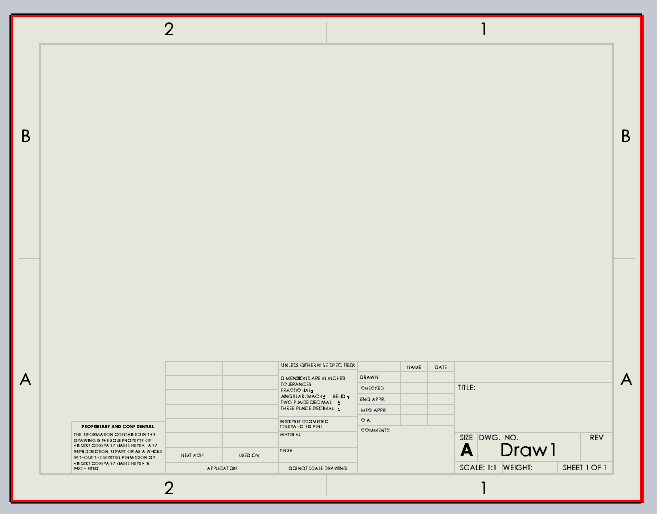

{ width=350 }

这个VBA宏在指定图层上绘制了活动工作表的边框。

宏会考虑工作表的比例尺来计算边框的正确坐标。

~~~ vb
Const LAYER_NAME As String = "Border"

Dim swApp As SldWorks.SldWorks

Sub main()

    Set swApp = Application.SldWorks
    
    Dim swDraw As SldWorks.DrawingDoc
    
    Set swDraw = swApp.ActiveDoc
    
    Dim swSheet As SldWorks.Sheet
    Set swSheet = swDraw.GetCurrentSheet
    
    Dim vSheetProps As Variant
    vSheetProps = swSheet.GetProperties2()
    
    Dim sheetScale As Double
    sheetScale = CDbl(vSheetProps(2)) / CDbl(vSheetProps(3))
    
    Dim width As Double
    Dim height As Double
    swSheet.GetSize width, height
    
    width = width / sheetScale
    height = height / sheetScale
    
    Dim swSkMgr As SldWorks.SketchManager
    
    Set swSkMgr = swDraw.SketchManager
    
    swSkMgr.AddToDB = True
    CreateLineOnLayer swSkMgr, 0, 0, width, 0, LAYER_NAME
    CreateLineOnLayer swSkMgr, width, 0, width, height, LAYER_NAME
    CreateLineOnLayer swSkMgr, width, height, 0, height, LAYER_NAME
    CreateLineOnLayer swSkMgr, 0, height, 0, 0, LAYER_NAME
    swSkMgr.AddToDB = False
    
End Sub

Sub CreateLineOnLayer(skMgr As SldWorks.SketchManager, x1 As Double, y1 As Double, x2 As Double, y2 As Double, layerName As String)
    
    Dim swSkSeg As SldWorks.SketchSegment
    Set swSkSeg = skMgr.CreateLine(x1, y1, 0, x2, y2, 0)
    swSkSeg.Layer = layerName
    
End Sub
~~~

