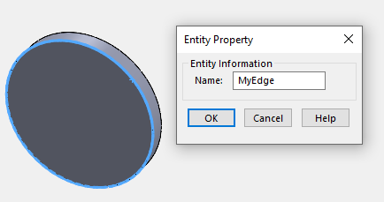

这个VBA宏演示了如何从底层的3D文档中找到特定命名的边缘，并在绘图视图中选择它。

这种技术可以在开发绘图自动化宏和应用程序时使用。

> 注意，在您的宏中，您可能不会使用命名实体，而是可以应用一些不同的逻辑（例如，通过坐标、颜色、属性等进行查找）。然而，将指针转换为绘图视图空间的过程是相同的。

这个宏将与包含命名边缘的顶层组件的装配体的绘图视图一起工作，如下所示：

> 如果需要，可以参考[按名称获取组件](/solidworks-api/document/assembly/components/get-by-name/)示例中的代码来获取任何级别上的组件。

边缘的名称需要从相应的零件文档中分配。

~~~ vb
Dim swApp As SldWorks.SldWorks

Sub main()

    Set swApp = Application.SldWorks
    
    Dim swDraw As SldWorks.DrawingDoc
        
    Set swDraw = swApp.ActiveDoc
    
    Dim swView As SldWorks.view
    Set swView = swDraw.FeatureByName("Drawing View1").GetSpecificFeature()
    
    Dim swEdge As SldWorks.edge
    Set swEdge = FindEdge(swDraw, swView, "Part1-1", "MyEdge")
    
    Debug.Print swView.SelectEntity(swEdge, False)
    
End Sub

Function FindEdge(draw As SldWorks.DrawingDoc, view As SldWorks.view, compName As String, edgeName As String) As SldWorks.edge
    
    Dim swAssy As SldWorks.AssemblyDoc
    Set swAssy = view.ReferencedDocument
    
    Dim swComp As SldWorks.Component2
    Set swComp = swAssy.GetComponentByName(compName)
    
    Dim swRefPart As SldWorks.PartDoc
    Set swRefPart = swComp.GetModelDoc2
    
    Dim swEdge As SldWorks.edge
    Set swEdge = swRefPart.GetEntityByName(edgeName, swSelectType_e.swSelEDGES)
    
    Set swEdge = swComp.GetCorresponding(swEdge)
    
    Set FindEdge = swEdge
    
End Function
~~~

