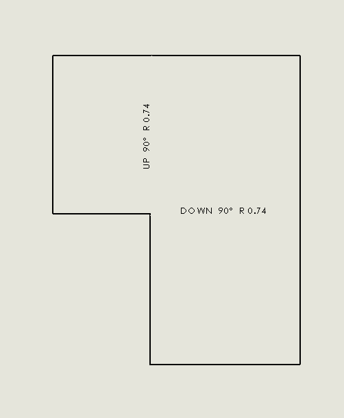

可以使用[SOLIDWORKS API的IBody2::GetMassProperties](https://help.solidworks.com/2016/english/api/sldworksapi/solidworks.interop.sldworks~solidworks.interop.sldworks.ibody2~getmassproperties.html)方法来找到特定物体的质量，但需要指定密度才能计算质量，这可能不容易提取。

如果需要找到绘图视图中物体的质量，这种方法可能不适用。如果将材料应用于物体本身，则该物体的密度不可用。可以从材料属性中提取密度，但需要[解析材料XML文件](http://localhost:4000/solidworks-api/document/materials/copy-custom-property/)以找到节点的值。

{ width=250 }

另一种选择是使用[IMassProperty](https://help.solidworks.com/2017/english/api/sldworksapi/SOLIDWORKS.Interop.sldworks~SOLIDWORKS.Interop.sldworks.IMassProperty.html)接口。

{ width=450 }

然而，在绘图上下文中提取的物体指针不适用于计算。在这种情况下，质量值始终为0。需要将物体指针转换为相应配置中的零件上下文。

以下是使用SOLIDWORKS API获取所选绘图视图中所有物体质量的C# VSTA宏代码，并在消息框中显示结果。

~~~ cs
using System;
using System.Collections.Generic;
using System.Linq;
using SolidWorks.Interop.sldworks;
using SolidWorks.Interop.swconst;

namespace GetMassPropertyFromBody
{
    public partial class SolidWorksMacro
    {
        public void Main()
        {
            try
            {
                var model = swApp.IActiveDoc2;

                if (model is IDrawingDoc)
                {
                    var view = model.ISelectionManager.GetSelectedObject6(1, -1) as IView;
                    
                    if (view != null)
                    {
                        var mass = GetViewBodiesMass(view);

                        swApp.SendMsgToUser2(string.Format("Mass of body(ies) in selected view is {0:0.000} kg", mass),
                                    (int)swMessageBoxIcon_e.swMbInformation,
                                    (int)swMessageBoxBtn_e.swMbOk);
                    }
                    else
                    {
                        throw new NullReferenceException("Please select drawing view");
                    }
                }
                else
                {
                    throw new InvalidCastException("Please open drawing document");
                }
            }
            catch(Exception ex)
            {
                swApp.SendMsgToUser2(ex.Message,
                    (int)swMessageBoxIcon_e.swMbStop,
                    (int)swMessageBoxBtn_e.swMbOk);
            }

            return;
        }

        private double GetViewBodiesMass(IView view)
        {
            if (view.ReferencedDocument is IPartDoc)
            {
                var bodies = GetViewBodies(view);

                var refDoc = view.ReferencedDocument;
                var activeConf = refDoc.ConfigurationManager.ActiveConfiguration.Name;
                refDoc.ShowConfiguration2(view.ReferencedConfiguration);

                try
                {
                    var partContextBodies = ConvertBodiesContext(bodies, view.ReferencedDocument as IPartDoc).ToArray();

                    var massPrp = refDoc.Extension.CreateMassProperty();

                    if (massPrp.AddBodies(partContextBodies))
                    {
                        return massPrp.Mass;
                    }
                    else
                    {
                        throw new InvalidOperationException(
                            "Failed to add bodies to the mass properties scope");
                    }
                }
                catch
                {
                    throw;
                }
                finally
                {
                    refDoc.ShowConfiguration2(activeConf);
                }
            }
            else
            {
                throw new InvalidCastException("Only part views are supported");
            }
        }

        private IBody2[] GetViewBodies(IView view)
        {
            IEnumerable<IBody2> bodies = null;

            if (view.IsFlatPatternView())
            {
                var visComps = view.GetVisibleComponents() as object[];

                if (visComps == null || !visComps.Any())
                {
                    throw new NullReferenceException("No components in this view");
                }

                var faces = view.GetVisibleEntities2(visComps.First() as Component2,
                    (int)swViewEntityType_e.swViewEntityType_Face) as object[];

                bodies = new IBody2[] 
                {
                    (faces.FirstOrDefault() as IFace2).IGetBody()
                };
            }
            else
            {
                bodies = (view.Bodies as object[]).Cast<IBody2>().ToArray();
            }

            return bodies.ToArray();
        }

        private IEnumerable<IBody2> ConvertBodiesContext(IEnumerable<IBody2> inputBodies, IPartDoc context)
        {
            var partBodies = (context.GetBodies2((int)swBodyType_e.swAllBodies, false) as object[]).Cast<IBody2>();

            return inputBodies.Select(b =>
            {
                var corrBody = partBodies.FirstOrDefault(
                    pb => pb.Name.Equals(b.Name, StringComparison.CurrentCultureIgnoreCase));

                if (corrBody == null)
                {
                    throw new NullReferenceException(string.Format("Failed to find the corresponding body of {0}", b.Name));
                }

                return corrBody;
            }).ToArray();
        }

        public SldWorks swApp;
    }
}

~~~

