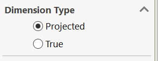

这个VBA宏会为活动SOLIDWORKS绘图中所有工作表的所有绘图视图设置尺寸类型（投影或真实）。

将**DIMS_TRUE**常量设置为**True**以将所有尺寸类型设置为**真实**。将**DIMS_TRUE**常量设置为**False**以将所有尺寸类型设置为**投影**。

~~~ vb
Const DIMS_TRUE As Boolean = False

Dim swApp As SldWorks.SldWorks

Sub main()

    Set swApp = Application.SldWorks
    
    Dim swDraw As SldWorks.DrawingDoc
    
    Set swDraw = swApp.ActiveDoc
    
    If Not swDraw Is Nothing Then
        
        Dim vSheets As Variant
        vSheets = swDraw.GetViews
        
        If Not IsEmpty(vSheets) Then
            
            Dim i As Integer
            
            For i = 0 To UBound(vSheets)
            
                Dim vViews As Variant
                vViews = vSheets(i)
                
                Dim j As Integer
                
                For j = 1 To UBound(vViews)
                    Dim swView As SldWorks.View
                    Set swView = vViews(j)
                    
                    swView.ProjectedDimensions = Not DIMS_TRUE
                Next
            
            Next
            
        End If
        
    Else
        Err.Raise vbError, "", "Open drawing"
    End If
    
End Sub
~~~

