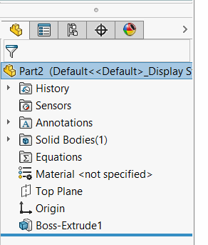

这个VBA宏允许在树中使选定的特征不可见。这些特征仍然可以在图形区域中完全运作和可见（例如平面），但在特征管理器树中不可见。

甚至默认特征（如平面）也可以被隐藏。

要显示隐藏的特征，请使用[显示隐藏特征](/solidworks-api/document/features-manager/reveal-hidden-features/)宏。

~~~ vb
Dim swApp As SldWorks.SldWorks

Sub main()

    Set swApp = Application.SldWorks
    
    Dim swModel As SldWorks.ModelDoc2
    
    Set swModel = swApp.ActiveDoc
    
    If Not swModel Is Nothing Then
        
        Dim swSelMgr As SldWorks.SelectionMgr
        Set swSelMgr = swModel.SelectionManager
        
        Dim i As Integer
        
        For i = 1 To swSelMgr.GetSelectedObjectCount2(-1)
            Dim swFeat As SldWorks.Feature
            Set swFeat = swSelMgr.GetSelectedObject6(i, -1)
            swFeat.SetUIState swUIStates_e.swIsHiddenInFeatureMgr, True
        Next
        
        swModel.EditRebuild3
    Else
        MsgBox "Please open the model"
    End If
    
End Sub
~~~

