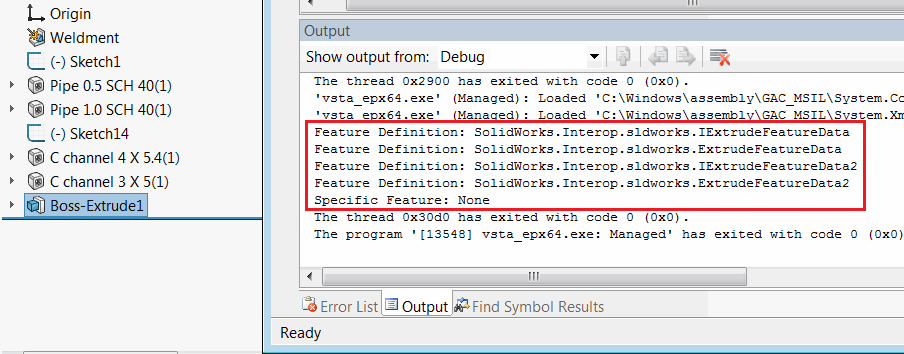

{ width=450 }

[IFeature::GetSpecificFeature2](https://help.solidworks.com/2012/english/api/sldworksapi/SolidWorks.Interop.sldworks~SolidWorks.Interop.sldworks.IFeature~GetSpecificFeature2.html)和[IFeature::GetDefinition](https://help.solidworks.com/2012/english/api/sldworksapi/solidworks.interop.sldworks~solidworks.interop.sldworks.ifeature~getdefinition.html) SOLIDWORKS API方法返回的分派指针在某些情况下不容易识别和转换为特定类型。

以下代码示例允许输出所选功能的定义和特定功能的所有可分配接口。结果将输出到VSTA编辑器的“输出”窗口中。

~~~ cs
using SolidWorks.Interop.sldworks;
using SolidWorks.Interop.swconst;
using System.Runtime.InteropServices;
using System;
using System.Collections.Generic;
using System.Diagnostics;

namespace CodeStack.csproj
{
    public partial class SolidWorksMacro
    {
        public void Main()
        {
            IFeature feat = swApp.IActiveDoc2.ISelectionManager.GetSelectedObject6(1, -1) as IFeature;

            PrintFeatureTypes(feat);
        }

        private void PrintFeatureTypes(IFeature feat) 
        {
            object featDef = feat.GetDefinition();

            if (featDef != null)
            {
                foreach (Type defType in FindSpecificInterfacesFromDispatch(featDef))
                {
                    Debug.Print("Feature Definition: " + defType.FullName);
                }
            }
            else
            {
                Debug.Print("Feature Definition: None");
            }

            object featSpec = feat.GetSpecificFeature2();

            if (featSpec != null)
            {
                foreach (Type specType in FindSpecificInterfacesFromDispatch(featSpec))
                {
                    Debug.Print("Specific Feature: " + specType.FullName);
                }
            }
            else
            {
                Debug.Print("Specific Feature: None");
            }
        }

        private IEnumerable<Type> FindSpecificInterfacesFromDispatch(object disp) 
        {
            if (disp == null) 
            {
                throw new ArgumentNullException("disp");
            }

            Type[] types = typeof(ISldWorks).Assembly.GetTypes();

            foreach (Type type in types) 
            {
                if (type.IsInstanceOfType(disp)) 
                {
                    yield return type;
                }
            }
        }

        public SldWorks swApp;
    }
}
~~~

