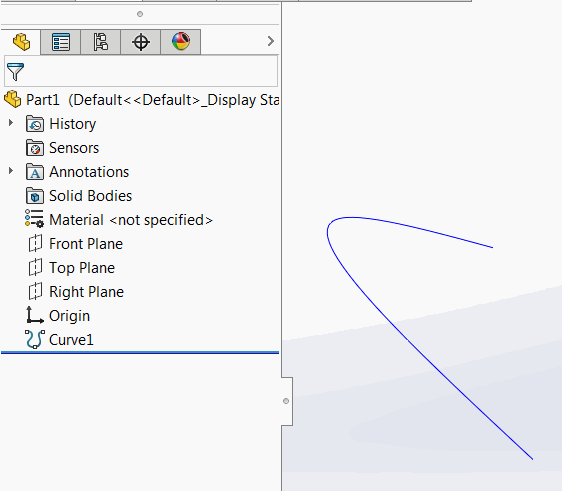
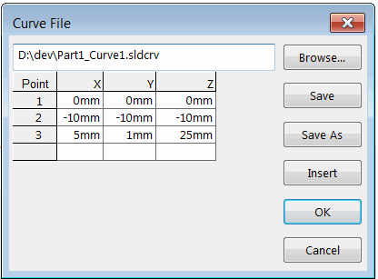

{ width=450 }

SOLIDWORKS允许通过外部文本文件中的XYZ坐标插入自由形式曲线。然而，该文件并未链接到特征本身，当外部文件更改时，曲线也不会更新。

{ width=300 }

这个VBA宏可以自动将外部文件与坐标链接起来，并通过单击更新所选曲线。

曲线文件示例：

~~~
0mm 0mm 0mm
10mm 10mm 10mm
5mm 1mm 25mm
~~~

曲线文本文件必须保存在与SOLIDWORKS文件相同的文件夹中，并且必须命名为[模型标题]_[特征名称].sldcrv。例如，如果曲线特征命名为*Curve1*，并且位于名为Part1.sldprt的SOLIDWORKS文件中，则曲线文本文件必须命名为*Part1_Curve1.sldcrv*。

~~~ vb
Dim swApp As SldWorks.SldWorks

Sub main()

    Set swApp = Application.SldWorks
    
    Dim swModel As SldWorks.ModelDoc2
    
    Set swModel = swApp.ActiveDoc
    
    If Not swModel Is Nothing Then
        
        Dim swFeat As SldWorks.Feature
        Set swFeat = swModel.SelectionManager.GetSelectedObject6(1, -1)
        
        If Not swFeat Is Nothing Then
            
            Dim swCurveFeatDef As SldWorks.FreePointCurveFeatureData
            Set swCurveFeatDef = swFeat.GetDefinition
            
            If Not swCurveFeatDef Is Nothing Then
                
                Dim filePath As String
                filePath = swModel.GetPathName
                filePath = Left(filePath, InStrRev(filePath, ".") - 1)
                filePath = filePath & "_" & swFeat.Name & ".sldcrv"
                
                If False = swCurveFeatDef.LoadPointsFromFile(filePath) Then
                    MsgBox "Failed to update curve"
                End If
                
                swFeat.ModifyDefinition swCurveFeatDef, swModel, Nothing
                
            Else
                MsgBox "Selected feature is not XYZ points curve"
            End If
        Else
            MsgBox "Please select Curve XYZ feature"
        End If
        
    Else
        MsgBox "Please open model"
    End If
    
End Sub
~~~

