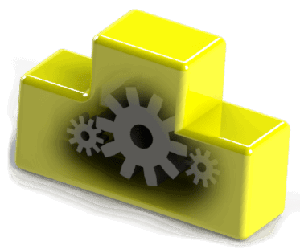

{ width=200 }

SOLIDWORKS文档（零件、装配和图纸）提供了大量的API函数用于自动化。

所有类型的文档通常都可以通过[IModelDoc2](https://help.solidworks.com/2012/English/api/sldworksapi/SOLIDWORKS.Interop.sldworks~SOLIDWORKS.Interop.sldworks.IModelDoc2.html)或[IModelDocExtension](https://help.solidworks.com/2012/english/api/sldworksapi/SOLIDWORKS.Interop.sldworks~SOLIDWORKS.Interop.sldworks.IModelDocExtension.html) SOLIDWORKS API接口访问通用功能。

这包括但不限于：

* 注释
* 草图
* 特征管理器

还有一些仅适用于特定类型文档的特定功能：

* 零件API可通过[IPartDoc](https://help.solidworks.com/2012/english/api/sldworksapi/solidworks.interop.sldworks~solidworks.interop.sldworks.ipartdoc.html)接口访问
* 装配API可通过[IAssemblyDoc](https://help.solidworks.com/2012/english/api/sldworksapi/solidworks.interop.sldworks~solidworks.interop.sldworks.iassemblydoc.html)接口访问
* 图纸API可通过[IDrawingDoc](https://help.solidworks.com/2012/english/api/sldworksapi/solidworks.interop.sldworks~solidworks.interop.sldworks.idrawingdoc.html)接口访问

特定接口可以转换为通用接口，反之亦然。

可以通过[IModelDoc2::Extension](https://help.solidworks.com/2012/english/api/sldworksapi/solidworks.interop.sldworks~solidworks.interop.sldworks.imodeldoc2~extension.html)属性访问IModelDocExtension。