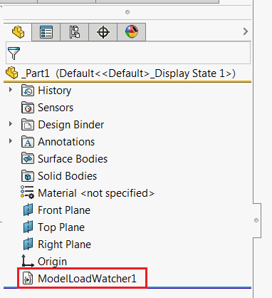



这个VBA宏使用SOLIDWORKS API将宏功能插入到模型中，并允许在加载带有此功能的模型时运行自定义代码。

当需要在每次模型加载时运行特定代码时，这非常有用（例如更新自定义属性、记录信息等）。

该功能在树中可见，并且如果需要，可以嵌入到文档模板中。

{ width=250 }

## 配置

* 创建新的宏
* 将代码复制到宏的相应模块中
* 要配置宏，请修改常量中定义的选项：

    * EMBED_MACRO_FEATURE - true表示将此宏直接嵌入到文档中。使用此选项，模型可以共享，并且在每台计算机上都可以使用（不需要共享宏）。有关此方法的优点和限制，请参阅[基于宏的宏功能](/solidworks-api/document/macro-feature/#macro-based-macro-feature)部分。
    * BASE_NAME - 特征的默认命名约定

~~~ vb
Const EMBED_MACRO_FEATURE As Boolean = True
Const BASE_NAME As String = "MyFeatureName"
~~~

* 将代码放入*HandlerModule*模块的*main*子程序中。将[IModelDoc2](https://help.solidworks.com/2012/english/api/sldworksapi/SolidWorks.Interop.sldworks~SolidWorks.Interop.sldworks.IModelDoc2.html)文档的指针作为参数传递。使用此指针而不是[SolidWorks.Interop.sldworks.ISldWorks::ActiveDoc](https://help.solidworks.com/2012/english/api/sldworksapi/solidworks.interop.sldworks~solidworks.interop.sldworks.isldworks~activedoc.html) SOLIDWORKS API属性，因为此方法适用于不可见文档（即作为装配或绘图组件加载的文档）。

~~~ vb
Sub main(model As SldWorks.ModelDoc2)
    'TODO: 在这里添加您的代码
End Sub
~~~

## 宏模块

插入特征并定义事件处理程序的主要宏例程

~~~ vb
Const EMBED_MACRO_FEATURE As Boolean = False
Const BASE_NAME As String = "ModelLoadWatcher"

Dim HandledModels As Collection

Sub main()

    Dim swApp As SldWorks.SldWorks
    Set swApp = Application.SldWorks
    
    Dim swModel As SldWorks.ModelDoc2
    
    Set swModel = swApp.ActiveDoc
    
    If Not swModel Is Nothing Then
        
        Dim curMacroPath As String
        curMacroPath = swApp.GetCurrentMacroPathName
        
        Dim vMethods(8) As String
        Dim moduleName As String
        
        GetMacroEntryPoint swApp, curMacroPath, moduleName, ""
        
        vMethods(0) = curMacroPath: vMethods(1) = moduleName: vMethods(2) = "swmRebuild"
        vMethods(3) = curMacroPath: vMethods(4) = moduleName: vMethods(5) = "swmEditDefinition"
        vMethods(6) = curMacroPath: vMethods(7) = moduleName: vMethods(8) = "swmSecurity"
        
        Dim opts As swMacroFeatureOptions_e
        
        If EMBED_MACRO_FEATURE Then
            opts = swMacroFeatureOptions_e.swMacroFeatureEmbedMacroFile
        Else
            opts = swMacroFeatureOptions_e.swMacroFeatureByDefault
        End If
        
        Dim swFeat As SldWorks.Feature
        Set swFeat = swModel.FeatureManager.InsertMacroFeature3(BASE_NAME, "", vMethods, _
            Empty, Empty, Empty, Empty, Empty, Empty, _
            Empty, opts)
        
        If swFeat Is Nothing Then
            MsgBox "Failed to create model load watcher"
        End If
        
    Else
        MsgBox "Please open model"
    End If
    
End Sub

Sub GetMacroEntryPoint(app As SldWorks.SldWorks, macroPath As String, ByRef moduleName As String, ByRef procName As String)
        
    Dim vMethods As Variant
    vMethods = app.GetMacroMethods(macroPath, swMacroMethods_e.swMethodsWithoutArguments)
    
    Dim i As Integer
    
    If Not IsEmpty(vMethods) Then
    
        For i = 0 To UBound(vMethods)
            Dim vData As Variant
            vData = Split(vMethods(i), ".")
            
            If i = 0 Or LCase(vData(1)) = "main" Then
                moduleName = vData(0)
                procName = vData(1)
            End If
        Next
        
    End If
    
End Sub

Function swmRebuild(varApp As Variant, varDoc As Variant, varFeat As Variant) As Variant
    swmRebuild = True
End Function

Function swmEditDefinition(varApp As Variant, varDoc As Variant, varFeat As Variant) As Variant
    swmEditDefinition = True
End Function

Function swmSecurity(varApp As Variant, varDoc As Variant, varFeat As Variant) As Variant

    Dim swFeat As SldWorks.Feature
    Set swFeat = varFeat
    
    If HandledModels Is Nothing Then
        Set HandledModels = New Collection
    End If

    Dim swModel As SldWorks.ModelDoc2
    Set swModel = varDoc
        
    If Not CollectionContains(HandledModels, swModel) Then
        
        HandledModels.Add swModel
        Dim swApp As SldWorks.SldWorks
        Set swApp = varApp
        ClearCache swApp
        
        OnModelLoad swModel
        
    End If

    swmSecurity = SwConst.swMacroFeatureSecurityOptions_e.swMacroFeatureSecurityByDefault

End Function

Sub ClearCache(app As SldWorks.SldWorks)
    
    If Not HandledModels Is Nothing Then
    
        Dim vDocs As Variant
        vDocs = app.GetDocuments
        
        If Not IsEmpty(vDocs) Then
            
            Dim i As Integer
            
            For i = HandledModels.Count To 1 Step -1
            
                Dim swModel As SldWorks.ModelDoc2
                Set swModel = HandledModels(i)
                
                If Not ArrayContains(vDocs, swModel) Then
                    HandledModels.Remove i
                End If
                
            Next
            
        End If
        
    End If
    
End Sub

Function CollectionContains(coll As Collection, model As SldWorks.ModelDoc2) As Boolean

    Dim i As Integer

    For i = 1 To coll.Count()
        If coll(i) Is model Then
            CollectionContains = True
            Exit Function
        End If
    Next

    CollectionContains = False

End Function

Function ArrayContains(arr As Variant, model As SldWorks.ModelDoc2) As Boolean

    Dim i As Integer

    If Not IsEmpty(arr) Then
        For i = 0 To UBound(arr)
            Dim thisModel As SldWorks.ModelDoc2
            Set thisModel = arr(i)
            If thisModel Is model Then
                ArrayContains = True
                Exit Function
            End If
        Next
    End If
    
    ArrayContains = False

End Function

Sub OnModelLoad(model As SldWorks.ModelDoc2)
    HandlerModule.main model
End Sub
~~~

## HandlerModule模块

插入每次模型加载时需要运行的必要代码的模块。必须命名为*HandlerModule*

~~~ vb
Sub main(model As SldWorks.ModelDoc2)
    'TODO: add your routine here
    MsgBox model.GetTitle()
End Sub
~~~

