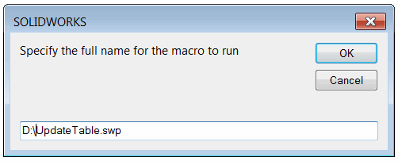
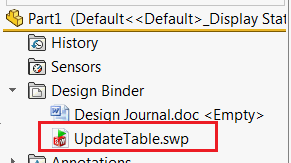
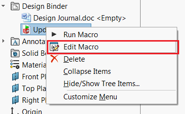

此宏允许使用SOLIDWORKS API在每次重建操作时自动运行指定的宏。

设置宏的步骤如下：

* 运行宏
* 指定要运行的宏的完整路径
{ width=250 }

此宏将作为设计绑定附件添加到模型中
{ width=250 }
* 宏功能将作为树中的最后一个特征插入宏中。

当模型重建时（手动或自动），宏将自动运行。

默认情况下，宏功能和宏被嵌入到模型中。这意味着可以在没有此宏的任何其他工作站上打开并更新模型。

这也可以直接嵌入到文档模板中。

### 选项
可以通过常量更改宏功能的名称

~~~ vb
Const BASE_NAME As String = "[特征名称]"
~~~

默认情况下，宏被嵌入到模型中。为了编辑宏代码，请使用设计绑定附件中的“编辑”命令

{ width=250 }

为了避免嵌入宏，请将以下常量更改为*False*

~~~ vb
Const EMBED_MACRO As Boolean = False
~~~

~~~ vb
Const BASE_NAME As String = "MacroRunner"
Const EMBED_MACRO As Boolean = True

Const PARAM_MACRO_NAME As String = "MacroName"
Const PARAM_MACRO_MODULE_NAME As String = "MacroModuleName"
Const PARAM_MACRO_PROC_NAME As String = "MacroProcName"

Sub main()

    Dim swApp As SldWorks.SldWorks
    Set swApp = Application.SldWorks
    
    Dim swModel As SldWorks.ModelDoc2
    
    Set swModel = swApp.ActiveDoc
    
    If Not swModel Is Nothing Then
        
        Dim macroToRunPath As String
        macroToRunPath = InputBox("Specify the full name for the macro to run")
        
        If macroToRunPath = "" Then
            Exit Sub
        End If
        
        If False = swModel.Extension.InsertAttachment(macroToRunPath, Not EMBED_MACRO) Then
            MsgBox "Failed to insert macro attachment"
            Exit Sub
        End If
        
        Dim curMacroPath As String
        curMacroPath = swApp.GetCurrentMacroPathName
        Dim vMethods(8) As String
        Dim moduleName As String
        
        GetMacroEntryPoint swApp, curMacroPath, moduleName, ""
        
        vMethods(0) = curMacroPath: vMethods(1) = moduleName: vMethods(2) = "swmRebuild"
        vMethods(3) = curMacroPath: vMethods(4) = moduleName: vMethods(5) = "swmEditDefinition"
        vMethods(6) = curMacroPath: vMethods(7) = moduleName: vMethods(8) = "swmSecurity"
        
        Dim vParamNames(2) As String
        vParamNames(0) = PARAM_MACRO_NAME
        vParamNames(1) = PARAM_MACRO_MODULE_NAME
        vParamNames(2) = PARAM_MACRO_PROC_NAME

        Dim vParamTypes(2) As Long
        vParamTypes(0) = swMacroFeatureParamType_e.swMacroFeatureParamTypeString
        vParamTypes(1) = swMacroFeatureParamType_e.swMacroFeatureParamTypeString
        vParamTypes(2) = swMacroFeatureParamType_e.swMacroFeatureParamTypeString

        Dim vParamValues(2) As String
        
        Dim macroToRunName As String
        Dim macroToRunModuleName As String
        Dim macroToRunProcName As String
        
        macroToRunName = Right(macroToRunPath, Len(macroToRunPath) - InStrRev(macroToRunPath, "\"))
        
        GetMacroEntryPoint swApp, macroToRunPath, macroToRunModuleName, macroToRunProcName

        vParamValues(0) = macroToRunName
        vParamValues(1) = macroToRunModuleName
        vParamValues(2) = macroToRunProcName

        Dim swFeat As SldWorks.Feature
        Set swFeat = swModel.FeatureManager.InsertMacroFeature3(BASE_NAME, "", vMethods, _
            vParamNames, vParamTypes, vParamValues, Empty, Empty, Empty, _
            Empty, swMacroFeatureOptions_e.swMacroFeatureEmbedMacroFile + swMacroFeatureOptions_e.swMacroFeatureAlwaysAtEnd)
        
        If swFeat Is Nothing Then
            MsgBox "Failed to create macro runner"
        End If
        
    Else
        MsgBox "Please open model"
    End If
    
End Sub

Function swmRebuild(varApp As Variant, varDoc As Variant, varFeat As Variant) As Variant

    Dim swApp As SldWorks.SldWorks
    Dim swFeat As SldWorks.Feature
    
    Set swApp = varApp
    Set swFeat = varFeat
    
    Dim swMacroFeat As SldWorks.MacroFeatureData
    Set swMacroFeat = swFeat.GetDefinition()
    
    Dim macroName As String
    Dim moduleName As String
    Dim procName As String
    
    swMacroFeat.GetStringByName PARAM_MACRO_NAME, macroName
    swMacroFeat.GetStringByName PARAM_MACRO_MODULE_NAME, moduleName
    swMacroFeat.GetStringByName PARAM_MACRO_PROC_NAME, procName
    
    swmRebuild = swApp.RunAttachedMacro(macroName, moduleName, procName)

End Function

Function swmEditDefinition(varApp As Variant, varDoc As Variant, varFeat As Variant) As Variant
    swmEditDefinition = True
End Function

Function swmSecurity(varApp As Variant, varDoc As Variant, varFeat As Variant) As Variant
    swmSecurity = SwConst.swMacroFeatureSecurityOptions_e.swMacroFeatureSecurityByDefault
End Function

Sub GetMacroEntryPoint(app As SldWorks.SldWorks, macroPath As String, ByRef moduleName As String, ByRef procName As String)
        
    Dim vMethods As Variant
    vMethods = app.GetMacroMethods(macroPath, swMacroMethods_e.swMethodsWithoutArguments)
    
    Dim i As Integer
    
    If Not IsEmpty(vMethods) Then
    
        For i = 0 To UBound(vMethods)
            Dim vData As Variant
            vData = Split(vMethods(i), ".")
            
            If i = 0 Or LCase(vData(1)) = "main" Then
                moduleName = vData(0)
                procName = vData(1)
            End If
        Next
        
    End If
    
End Sub
~~~

