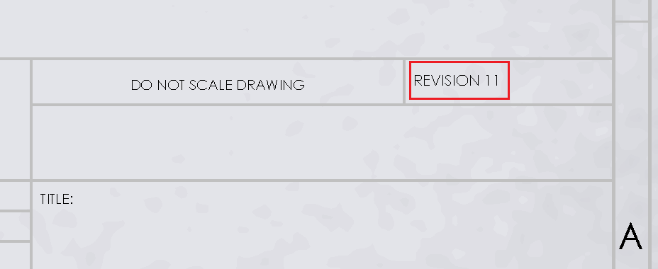

{ width=300 }

该宏使用SOLIDWORKS API来增加注释的数值。如果需要增加注释的修订版本而无需手动选择和更改注释，则这将非常有用。该宏还可以在批处理软件中使用。

* 数值通过指定的[正则表达式](https://en.wikipedia.org/wiki/Regular_expression)进行匹配。可以修改正则表达式以匹配特定的数值。注释可以包含自由文本（在这种情况下，只有数值部分将根据指定的正则表达式进行更新）
* 需要在注释中添加文本标签以增加其数值。请按照[向选定的注释添加标签](/solidworks-api/document/notes/tag-selected-note)示例中的说明添加标签到注释中。
* 默认情况下，数值将增加1，但可以通过修改*IncrementNoteValue*函数的*increment*参数的值来更改。

~~~ vb
Dim swApp As SldWorks.SldWorks
Dim swModel As SldWorks.ModelDoc2

Sub main()

    Set swApp = Application.SldWorks
    
    Set swModel = swApp.ActiveDoc
    
    IncrementNoteValue "_CodeStackNote_", "\d+", 1
    
End Sub

Sub IncrementNoteValue(noteTag As String, pattern As String, increment As Double)
    
    Dim swNote As SldWorks.Note
    Set swNote = FindNodeByTag(swModel, noteTag)
    
    If Not swNote Is Nothing Then
        Dim newText As String
        newText = IncrementNumericMatches(swNote.GetText(), pattern, increment)
        swNote.SetText newText
    End If
    
End Sub

Function IncrementNumericMatches(text As String, pattern As String, increment As Double) As String
    
    Dim resultText As String
    resultText = text
    
    Dim regEx As Object
    Set regEx = CreateObject("VBScript.RegExp")
    
    regEx.Global = True
    regEx.IgnoreCase = True
    regEx.pattern = pattern
    
    Dim regExMatches As Object
    Set regExMatches = regEx.Execute(text)
    
    If regExMatches.Count > 0 Then
        
        Dim i As Integer
        
        Dim offset As Integer
        
        For i = 0 To regExMatches.Count - 1
            
            Dim regExMatch As Object
            Set regExMatch = regExMatches(i)
            
            Dim newValue As Double
            newValue = CDbl(regExMatch.Value) + increment
            
            resultText = Left(resultText, regExMatch.FirstIndex + offset) & newValue & Right(resultText, Len(resultText) - regExMatch.FirstIndex - regExMatch.Length - offset)
            
            offset = offset + Len(CStr(newValue)) - regExMatch.Length
        
        Next
        
    End If
    
    IncrementNumericMatches = resultText

End Function

Function FindNodeByTag(model As SldWorks.ModelDoc2, tag As String) As SldWorks.Note
    
    If tag <> "" Then
        
        Dim vAnnots As Variant
        vAnnots = model.Extension.GetAnnotations
        
        Dim swNote As SldWorks.Note
        Dim i As Integer
        
        If Not IsEmpty(vAnnots) Then
            
            For i = 0 To UBound(vAnnots)
                
                Dim swAnn As SldWorks.Annotation
                Set swAnn = vAnnots(i)
                
                If swAnn.GetType() = swAnnotationType_e.swNote Then
                    Set swNote = swAnn.GetSpecificAnnotation
                    If swNote.TagName = tag Then
                        Set FindNodeByTag = swNote
                        Exit Function
                    End If
                End If
                
            Next
        End If
        
        If model.GetType() = swDocumentTypes_e.swDocDRAWING Then
        
            Dim swDraw As SldWorks.DrawingDoc
            Set swDraw = model
        
            Dim vSheets As Variant
            vSheets = swDraw.GetViews()
            
            For i = 0 To UBound(vSheets)
                
                Dim vViews As Variant
                vViews = vSheets(i)
                
                Dim j As Integer
                
                For j = 0 To UBound(vViews)
                
                    Dim swView As SldWorks.View
                    Set swView = vViews(j)
                
                    Dim vNotes As Variant
                    
                    vNotes = swView.GetNotes()
                    
                    Dim k As Integer
                    
                    For k = 0 To UBound(vNotes)
                        
                        Set swNote = vNotes(k)
                        
                        If swNote.TagName = tag Then
                            Set FindNodeByTag = swNote
                            Exit Function
                        End If
                    
                    Next
                
                Next
                
            Next
            
        End If
        
    End If
    
End Function
~~~

