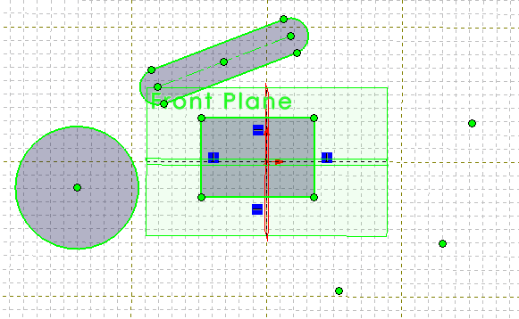

{ width=250 }

此示例演示了如何使用SOLIDWORKS API中的直接::Select方法选择活动草图中的所有草图线段和草图点。

~~~ vb
Dim swApp As SldWorks.SldWorks

Sub main()

    Set swApp = Application.SldWorks
    
    Dim swModel As SldWorks.ModelDoc2
    
    Set swModel = swApp.ActiveDoc
    
    If Not swModel Is Nothing Then
        
        Dim swSketch As SldWorks.sketch
        Set swSketch = swModel.SketchManager.ActiveSketch
        
        If Not swSketch Is Nothing Then
            
            swModel.ClearSelection2 True
            
            SelectAllSketchSegments swSketch
            
            SelectAllSketchPoints swSketch
            
        Else
            MsgBox "Please open sketch"
        End If
        
    Else
        MsgBox "Please open part or assembly"
    End If
    
End Sub

Sub SelectAllSketchSegments(sketch As SldWorks.sketch)
    
    Dim vSegs As Variant
        
    vSegs = sketch.GetSketchSegments
    
    Dim i As Integer
    
    For i = 0 To UBound(vSegs)
        Dim swSkSeg As SldWorks.SketchSegment
        Set swSkSeg = vSegs(i)
        swSkSeg.Select4 True, Nothing
    Next
    
End Sub

Sub SelectAllSketchPoints(sketch As SldWorks.sketch)
    
    Dim vPoints As Variant
        
    vPoints = sketch.GetSketchPoints2
    
    Dim i As Integer
    
    For i = 0 To UBound(vPoints)
        Dim swSkPt As SldWorks.SketchPoint
        Set swSkPt = vPoints(i)
        swSkPt.Select4 True, Nothing
    Next
    
End Sub
~~~

