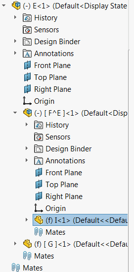

{ width=200 }

本示例演示了使用SOLIDWORKS API通过组件的完整名称在装配体的任何级别上选择组件的最高效方法。

组件的名称定义为一个路径，每个级别之间用/符号分隔。组件实例ID用-符号指定（例如，FirstLevelComp-1/SecondLevelComp-2/TargetComp-1）。

组件名称可以在以下对话框中找到：

{ width=250 }

请参考[按名称获取组件](/solidworks-api/document/assembly/components/get-by-name)示例，了解如何在不进行选择的情况下检索到组件的指针。

~~~ vb
Dim swApp As SldWorks.SldWorks

Sub main()

    Set swApp = Application.SldWorks
    
    Dim swAssy As SldWorks.AssemblyDoc
    
    Set swAssy = swApp.ActiveDoc

    Debug.Print SelectComponentByName(swAssy, "E-1/F^E-1/I-1")

End Sub

Function SelectComponentByName(assy As SldWorks.AssemblyDoc, name As String) As Boolean
    
    Dim rootName As String
    rootName = assy.GetTitle()
    
    Dim extPos As Long
    extPos = InStr(rootName, ".")
    If extPos <> -1 Then
        rootName = Left(rootName, extPos - 1)
    End If
    
    Dim selByIdStr As String
    selByIdStr = ConvertToSelectByIDString(rootName, name)
    
    SelectComponentByName = assy.Extension.SelectByID2(selByIdStr, "COMPONENT", 0, 0, 0, False, -1, Nothing, swSelectOption_e.swSelectOptionDefault)
    
End Function

Function ConvertToSelectByIDString(rootName As String, name As String) As String

    Dim vNameParts As Variant
    vNameParts = Split(name, "/")
    
    Dim prevParentName As String
    prevParentName = rootName
    
    Dim selByIdStr As String
    
    Dim i As Integer
    
    For i = 0 To UBound(vNameParts)
        
        Dim curPartName As String
        curPartName = vNameParts(i)
        
        If selByIdStr <> "" Then
            selByIdStr = selByIdStr & "/"
        End If
        
        selByIdStr = selByIdStr & curPartName & "@" & prevParentName
        
        prevParentName = Left(curPartName, InStrRev(curPartName, "-") - 1)
        
    Next
    
    ConvertToSelectByIDString = selByIdStr
    
End Function
~~~

