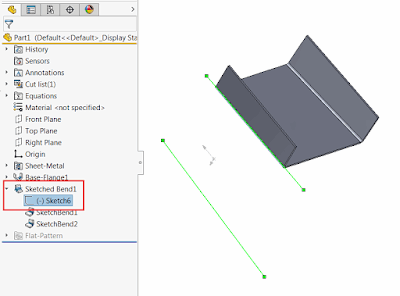

使用SOLIDWORKS API，宏程序可以找到钣金*弯曲特征*中的所有直线（弯曲），并选择所有线段。

{ width=400 }

目前没有直接的SOLIDWORKS API方法可以获取弯曲，但是弯曲在由钣金特征拥有的草图中表示为草图线段。因此，为了找到弯曲，需要找到该草图并解析其内容。

~~~ vb
Dim swApp As SldWorks.SldWorks
Dim swModel As SldWorks.ModelDoc2
Dim swSelMgr As SldWorks.SelectionMgr

Sub main()

    Set swApp = Application.SldWorks
    
    Set swModel = swApp.ActiveDoc
        
    If Not swModel Is Nothing Then
    
        Set swSelMgr = swModel.SelectionManager
        
        Dim swFeat As SldWorks.Feature
        
        Set swFeat = swSelMgr.GetSelectedObject6(1, -1)
        
        If swFeat.GetTypeName2 = "SM3dBend" Then
        
            Dim swBendSketch As SldWorks.Sketch
            
            Set swBendSketch = FindBendSketch(swFeat)
            
            Dim vSegs As Variant
            vSegs = swBendSketch.GetSketchSegments()
            
            swModel.ClearSelection2 True
            
            Dim i As Integer
            
            For i = 0 To UBound(vSegs)
                
                Dim swSkSeg As SldWorks.SketchSegment
                Set swSkSeg = vSegs(i)
                
                If swSkSeg.GetType() = swSketchSegments_e.swSketchLINE Then
                    swSkSeg.Select4 True, Nothing
                End If
                
            Next
            
        Else
            MsgBox "Please select sketched bend feature"
        End If
        
    Else
        MsgBox "Please open the model"
    End If
    
End Sub

Function FindBendSketch(swFeat As SldWorks.Feature) As SldWorks.Sketch
    
    Dim swSubFeat As SldWorks.Feature
    
    Set swSubFeat = swFeat.GetFirstSubFeature
    
    Do While Not swSubFeat Is Nothing And swSubFeat.GetTypeName2() <> "ProfileFeature"
        
        Set swSubFeat = swSubFeat.GetNextSubFeature
        
    Loop
    
    If Not swSubFeat Is Nothing Then
    
        Set FindBendSketch = swSubFeat.GetSpecificFeature2
        
    Else
        MsgBox "Failed to find the skecth with bends"
        End
    End If
    
End Function

~~~

