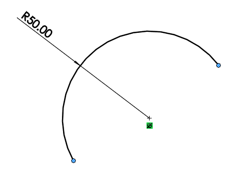

{ width=350 }

这个VBA宏示例演示了如何在选定的草图弧线的起点和终点之间应用合并草图关系，将其转换为草图圆形。这相当于手动拖动点直到合并或在关系管理器中添加合并草图关系。

~~~ vb
Dim swApp As SldWorks.SldWorks

Sub main()

    Set swApp = Application.SldWorks
    
    Dim swModel As SldWorks.ModelDoc2
    
    Set swModel = swApp.ActiveDoc
    
    If Not swModel Is Nothing Then
        
        Dim swSkArc As SldWorks.SketchArc
        Set swSkArc = swModel.SelectionManager.GetSelectedObject6(1, -1)
        
        If Not swSkArc Is Nothing Then
            Dim swEndPts(1) As SldWorks.SketchPoint
            Set swEndPts(0) = swSkArc.GetStartPoint2()
            Set swEndPts(1) = swSkArc.GetEndPoint2()
            swModel.SketchManager.ActiveSketch.RelationManager.AddRelation swEndPts, swConstraintType_e.swConstraintType_MERGEPOINTS
        Else
            MsgBox "Please select sketch arc"
        End If
        
    Else
        MsgBox "Please open the model"
    End If
    
End Sub
~~~

