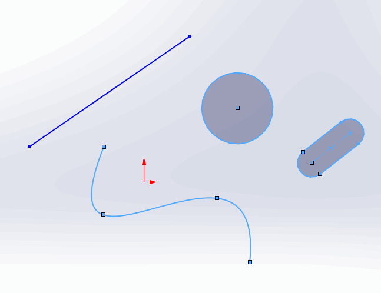
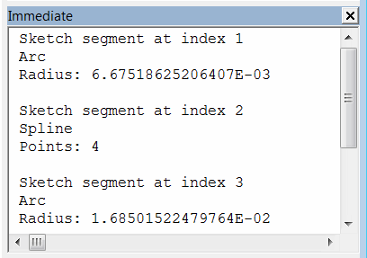

{ width=450 }

这个VBA宏演示了如何使用SOLIDWORKS API从选定的线段中提取特定的草图线段信息。

宏将遍历所有选定的对象并过滤草图线段。宏会识别线段的类型，并将指针转换为特定的子类型（如直线、样条、弧线、抛物线、文本等）。

信息将输出到VBA编辑器的即时窗口。

{ width=350 }

~~~ vb
Dim swApp As SldWorks.SldWorks

Sub main()

    Set swApp = Application.SldWorks
    
    Dim swModel As SldWorks.ModelDoc2
    
    Set swModel = swApp.ActiveDoc
    
    If Not swModel Is Nothing Then
    
        Dim swSelMgr As SldWorks.SelectionMgr
        
        Set swSelMgr = swModel.SelectionManager
        
        Dim i As Integer
        
        For i = 1 To swSelMgr.GetSelectedObjectCount2(-1)
            If swSelMgr.GetSelectedObjectType3(i, -1) = swSelectType_e.swSelSKETCHSEGS Or _
                swSelMgr.GetSelectedObjectType3(i, -1) = swSelectType_e.swSelEXTSKETCHSEGS Then
                
                Dim swSkSeg As SldWorks.SketchSegment
                Set swSkSeg = swSelMgr.GetSelectedObject6(i, -1)
                
                Debug.Print "Sketch segment at index " & i
                
                PrintSketchSegmentInfo swSkSeg
                
                Debug.Print ""
                
            End If
        Next
        
    Else
        MsgBox "Please open model"
    End If
    
End Sub

Function PrintSketchSegmentInfo(skSeg As SldWorks.SketchSegment)

    Select Case skSeg.GetType()
        Case swSketchSegments_e.swSketchARC
            Dim swSkArc As SldWorks.SketchArc
            Set swSkArc = skSeg
            Debug.Print "Arc"
            Debug.Print "Radius: " & swSkArc.GetRadius()
        
        Case swSketchSegments_e.swSketchELLIPSE
            Dim swSkEllipse As SldWorks.SketchEllipse
            Set swSkEllipse = skSeg
            Dim swMajPoint As SldWorks.SketchPoint
            Set swMajPoint = swSkEllipse.GetMajorPoint2()
            Debug.Print "Ellipse"
            Debug.Print "Major Point: " & swMajPoint.X & "," & swMajPoint.Y & "," & swMajPoint.Z
        
        Case swSketchSegments_e.swSketchLINE
            Dim swSkLine As SldWorks.SketchLine
            Set swSkLine = skSeg
            Debug.Print "Line"
            Debug.Print "Angle: " & swSkLine.Angle
            
        Case swSketchSegments_e.swSketchPARABOLA
            Dim swSkParabola As SldWorks.SketchParabola
            Set swSkParabola = skSeg
            Dim swApexPoint As SldWorks.SketchPoint
            Set swApexPoint = swSkParabola.GetApexPoint2
            Debug.Print "Parabola"
            Debug.Print "Apex Point: " & swApexPoint.X & "," & swApexPoint.Y & "," & swApexPoint.Z
        
        Case swSketchSegments_e.swSketchSPLINE
            Dim swSkSpline As SldWorks.SketchSpline
            Set swSkSpline = skSeg
            Dim vSplinePts As Variant
            vSplinePts = swSkSpline.GetPoints2()
            Debug.Print "Spline"
            Debug.Print "Points: " & UBound(vSplinePts) + 1
        
        Case swSketchSegments_e.swSketchTEXT
            Dim swSkText As SldWorks.SketchText
            Set swSkText = skSeg
            Debug.Print "Text"
            Debug.Print swSkText.Text
        Case Else
            Err.Raise vbError, "", "Unsupported sketch segment"
    End Select
    
End Function
~~~

