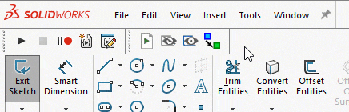
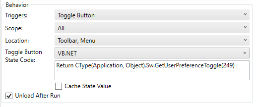

这个VBA宏允许在SOLIDWORKS草图中切换启用或禁用“启用”选项。

## 在工具栏+中使用宏

这个宏可以在[工具栏+](https://cadplus.xarial.com/toolbar/)中使用，这将改善用户体验。可以为宏按钮启用[切换状态](https://cadplus.xarial.com/toolbar/configuration/toggles/)。

将以下代码粘贴到“切换按钮状态代码”文本框中：

~~~ vb
Return CType(Application, Object).Sw.GetUserPreferenceToggle(249)
~~~

下载图标[在此处](toggle-snapping.svg)

~~~ vb
Dim swApp As SldWorks.SldWorks

Sub main()

    Set swApp = Application.SldWorks
    
    Dim curVal As Boolean
    curVal = False <> swApp.GetUserPreferenceToggle(swUserPreferenceToggle_e.swSketchInference)
    
    swApp.SetUserPreferenceToggle swUserPreferenceToggle_e.swSketchInference, Not curVal
    
End Sub
~~~

