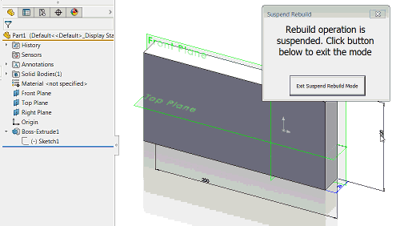

该宏使用SOLIDWORKS API来暂停零件、装配体和图纸的重建操作，以提高性能。

当宏启动时，会显示一个表单。在表单打开期间，所有重建操作（重新生成）都将被暂停。
例如，直到点击**退出暂停重建模式**按钮之前，尺寸更改或配合关系都不会解决。

[下载宏](FreezeRebuild.swp)

**主模块**

~~~ vb
Sub main()

    FreezeRebuildForm.Show vbModeless

End Sub
~~~

**用户表单**

~~~ vb
Const CANCEL_REGEN As Long = 1

Dim swApp As SldWorks.SldWorks

Dim WithEvents swPart As SldWorks.PartDoc
Dim WithEvents swAssy As SldWorks.AssemblyDoc
Dim WithEvents swDraw As SldWorks.DrawingDoc

Private Sub btnExit_Click()
    End
End Sub

Private Sub UserForm_Initialize()
    
    Set swApp = Application.SldWorks
    
    Dim swModel As SldWorks.ModelDoc2
    
    Set swModel = swApp.ActiveDoc
    
    If Not swModel Is Nothing Then
        Select Case swModel.GetType()
            Case swDocumentTypes_e.swDocPART
                Set swPart = swModel
            Case swDocumentTypes_e.swDocASSEMBLY
                Set swAssy = swModel
            Case swDocumentTypes_e.swDocDRAWING
                Set swDraw = swModel
        End Select
            
    Else
        MsgBox "Please open the model"
        End
    End If
    
End Sub

Private Function swAssy_RegenNotify() As Long
    swAssy_RegenNotify = CANCEL_REGEN
End Function

Private Function swDraw_RegenNotify() As Long
    swDraw_RegenNotify = CANCEL_REGEN
End Function

Private Function swPart_RegenNotify() As Long
    swPart_RegenNotify = CANCEL_REGEN
End Function
~~~

