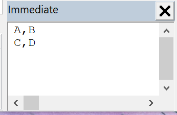

这个VBA宏通过指定单元格中的值模式来查找表格。

{ width=500 }

表格的数据被读取到字符串变量**tableData**中，并输出到[VBA即时窗口](/visual-basic/vba/vba-editor/windows#immediate-window)中。

单元格之间使用**DELIMETER**常量的值进行分隔。

可以使用匹配模式来匹配单元格的值（例如**\*ABC\***将匹配包含**ABC**的文本）

文本比较不区分大小写。

要搜索的行和列的索引是从0开始的（例如第一列中的第一个单元格的索引为**0, 0**）。

在调用**FindTableByContent**函数时，提供搜索模式的值和目标单元格的位置。

~~~ vb jagged
Set swTableAnnotation = FindTableByContent(swDraw, "*ABC*", 0, 0)
~~~

~~~ vb
Option Compare Text

Const DELIMETER As String = ","

Dim swApp As SldWorks.SldWorks

Sub main()

    Set swApp = Application.SldWorks
    
    Dim swDraw As SldWorks.DrawingDoc
    
    Set swDraw = swApp.ActiveDoc
    
    If Not swDraw Is Nothing Then
        
        Dim tableData As String
        
        Dim swTableAnnotation As SldWorks.TableAnnotation
        Set swTableAnnotation = FindTableByContent(swDraw, "a", 0, 0)
                
        Dim i As Integer
        Dim j As Integer
        
        For i = 0 To swTableAnnotation.RowCount - 1
            
            If i > 0 Then
                tableData = tableData & vbLf
            End If
            
            For j = 0 To swTableAnnotation.ColumnCount - 1
                If j > 0 Then
                    tableData = tableData & DELIMETER
                End If
                tableData = tableData & swTableAnnotation.Text(i, j)
            Next
            
        Next
        
        Debug.Print tableData
        
    Else
        Err.Raise "Open drawing"
    End If
    
End Sub

Function FindTableByContent(draw As SldWorks.DrawingDoc, searchCellVal As String, cellRow As Integer, cellColumn As Integer) As SldWorks.TableAnnotation
    
    Dim vSheets As Variant
    
    vSheets = draw.GetViews()
    
    Dim i As Integer
    
    For i = 0 To UBound(vSheets)
        
        Dim vViews As Variant
        vViews = vSheets(i)
        
        Dim swSheetView As SldWorks.View
        Set swSheetView = vViews(0)
        
        Dim vTableAnns As Variant
        vTableAnns = swSheetView.GetTableAnnotations
        
        If Not IsEmpty(vTableAnns) Then
            
            Dim j As Integer
            
            For j = 0 To UBound(vTableAnns)
                
                Dim swTableAnn As SldWorks.TableAnnotation
                Set swTableAnn = vTableAnns(j)
                
                Dim cellVal As String
                cellVal = swTableAnn.Text(cellRow, cellColumn)
                
                If cellVal Like searchCellVal Then
                    Set FindTableByContent = swTableAnn
                    Exit Function
                End If
                
            Next
            
        End If
        
    Next
    
    Err.Raise vbError, "", "Failed to find the table annotation"
    
End Function
~~~

