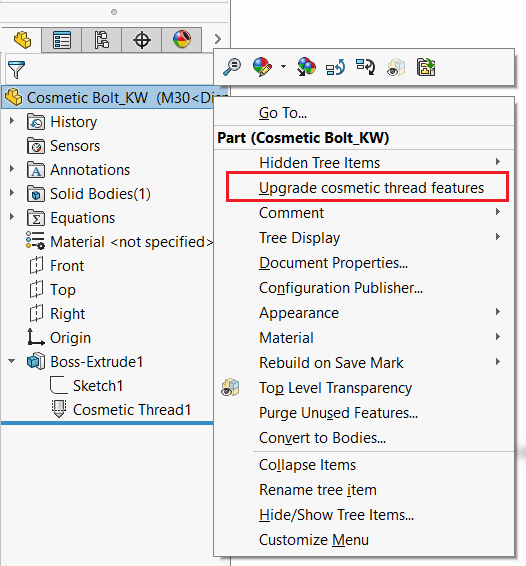

{ width=500 }

此宏在SOLIDWORKS零件和装配中调用“升级美化螺纹特征”命令，可能会提高文档的性能。

此宏可与[SOLIDWORKS任务计划程序](https://help.solidworks.com/2019/English/SolidWorks/sldworks/c_SOLIDWORKS_Task_Scheduler_Overview.htm)或[Batch+](https://cadplus.xarial.com/batch/)等任务自动化软件一起使用。

~~~ vb
Dim swApp As SldWorks.SldWorks
Dim swModel As SldWorks.ModelDoc2

Sub main()

    Set swApp = Application.SldWorks

    Dim allowUpgrade As Boolean
    allowUpgrade = swApp.GetUserPreferenceToggle(swUserPreferenceToggle_e.swEnableAllowCosmeticThreadsUpgrade)

try:
    On Error GoTo catch
    
    Set swModel = swApp.ActiveDoc
        
    If Not swModel Is Nothing Then
                
        swApp.SetUserPreferenceToggle swUserPreferenceToggle_e.swEnableAllowCosmeticThreadsUpgrade, True
        
        If False = swModel.Extension.UpgradeLegacyCThreads() Then
            Debug.Print "Thread is not upgraded"
        End If
            
    Else
        Err.Raise vbError, "", "Please open document"
    End If
    
    GoTo finally
    
catch:
    swApp.SendMsgToUser2 Err.Description, swMessageBoxIcon_e.swMbStop, swMessageBoxBtn_e.swMbOk
finally:
    
    swApp.SetUserPreferenceToggle swUserPreferenceToggle_e.swEnableAllowCosmeticThreadsUpgrade, allowUpgrade

End Sub
~~~

