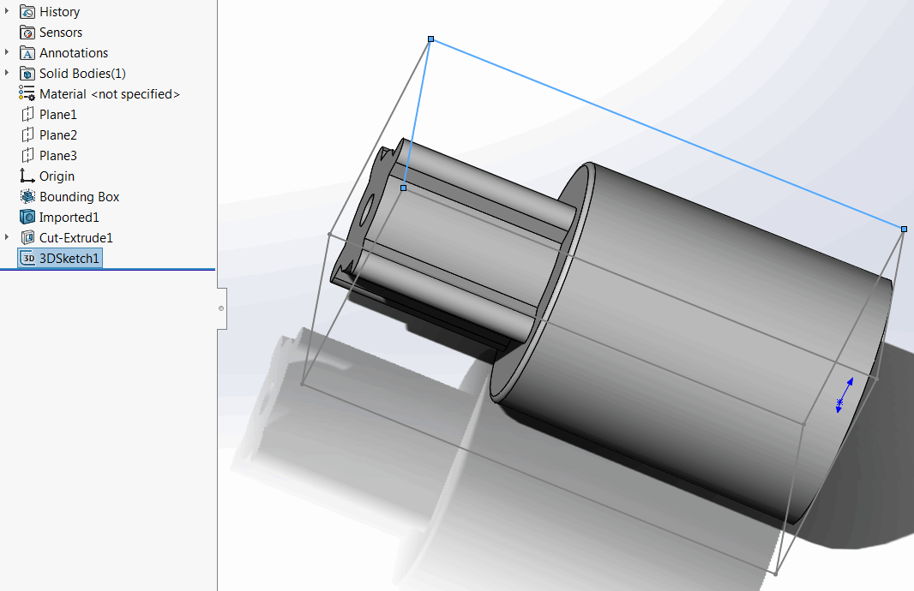

{ width=450 }

SOLIDWORKS可以在零件文档中插入3D边界框。然而，这个边界框的边缘（线段）不能被选择和用于建模目的。

这个VBA宏基于SOLIDWORKS 3D边界框创建一个边界框草图。草图中的所有线段都可以被选择和用于参考或几何创建。

## 注意事项

* 宏将使用现有的3D边界框，如果不存在则创建新的边界框
* 生成的边界框在原始边界框更改后（重建后）会自动更新
    * 原始边界框必须可见以更新派生边界框

~~~ vb
Dim swApp As SldWorks.SldWorks

Sub main()

    Set swApp = Application.SldWorks
    
    Dim swModel As SldWorks.ModelDoc2
    
    Set swModel = swApp.ActiveDoc
    
    If Not swModel Is Nothing Then
        
        Dim swFeat As SldWorks.Feature
        
        Set swFeat = GetBoundingBoxFeature(swModel)
        
        If Not swFeat Is Nothing Then
        
            Dim swSketch As SldWorks.Sketch
            Set swSketch = swFeat.GetSpecificFeature2
            
            Dim vSegs As Variant
            
            vSegs = swSketch.GetSketchSegments
            
            ConvertSegmentsIntoSketch swModel, vSegs
            
        Else
            MsgBox "Failed to get bounding box feature"
        End If
    
    Else
        MsgBox "Please open document"
    End If
    
End Sub

Function GetBoundingBoxFeature(model As SldWorks.ModelDoc2) As SldWorks.Feature
    
    Dim swFeat As SldWorks.Feature
    Set swFeat = FindBoundingBoxFeature(model)
    
    If swFeat Is Nothing Then
        
        Dim status As Long
        model.FeatureManager.InsertGlobalBoundingBox swGlobalBoundingBoxFitOptions_e.swBoundingBoxType_BestFit, False, False, status
        
        Set swFeat = FindBoundingBoxFeature(model)
        
    End If
    
    Set GetBoundingBoxFeature = swFeat
    
End Function

Function FindBoundingBoxFeature(model As SldWorks.ModelDoc2) As SldWorks.Feature
    
    Dim swFeat As SldWorks.Feature
    Set swFeat = model.FirstFeature
    
    While Not swFeat Is Nothing
        
        If swFeat.GetTypeName2() = "BoundingBoxProfileFeat" Then
            Set FindBoundingBoxFeature = swFeat
            Exit Function
        End If
        
        Set swFeat = swFeat.GetNextFeature
        
    Wend
    
    Set FindBoundingBoxFeature = Nothing
    
End Function

Sub ConvertSegmentsIntoSketch(model As SldWorks.ModelDoc2, segs As Variant)
    
    If model.SketchManager.ActiveSketch Is Nothing Then
        model.SketchManager.Insert3DSketch True
    Else
        If False = model.SketchManager.ActiveSketch.Is3D() Then
            Err.Raise vbError, "", "Only 3D sketch is supported"
        End If
    End If
    
    Dim i As Integer
    
    model.ClearSelection2 True
    
    For i = 0 To UBound(segs)
        Dim swSkSeg As SldWorks.SketchSegment
        Set swSkSeg = segs(i)
        swSkSeg.Select4 True, Nothing
    Next
    
    model.SketchManager.SketchUseEdge3 False, False
    
    model.SketchManager.Insert3DSketch True
    
End Sub
~~~

