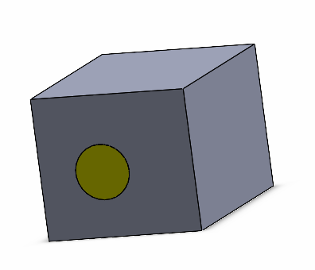

这个VBA示例演示了如何使用[IModeler::CreateBodyFromFaces2](https://help.solidworks.com/2017/English/api/sldworksapi/SOLIDWORKS.Interop.sldworks~SOLIDWORKS.Interop.sldworks.IModeler~CreateBodyFromFaces2.html) API来填充所选特征（例如切割拉伸）中的孔洞，并生成临时几何体。

宏停止执行并显示临时几何体。继续执行以删除临时几何体。

~~~ vb
Dim swApp As SldWorks.SldWorks

Sub main()

    Set swApp = Application.SldWorks
    
    Dim swModel As SldWorks.ModelDoc2
    
    Set swModel = swApp.ActiveDoc
    
    If swModel Is Nothing Then
        Err.Raise vbError, "", "Open model"
    End If
    
    Dim swSelMgr As SldWorks.SelectionMgr
    Set swSelMgr = swModel.SelectionManager
    
    Dim swFeat As SldWorks.Feature
    Set swFeat = swSelMgr.GetSelectedObject6(1, -1)
    
    If swFeat Is Nothing Then
        Err.Raise vbError, "", "Select feature"
    End If
    
    Dim vFaces As Variant
    
    Dim swTempBody As SldWorks.Body2
        
    vFaces = swFeat.GetFaces
    
    Dim swModeler As SldWorks.Modeler
    Set swModeler = swApp.GetModeler
    
    Set swTempBody = swModeler.CreateBodyFromFaces2(UBound(vFaces) + 1, vFaces, swCreateFacesBodyAction_e.swCreateFacesBodyActionCap, _
                                                False, False)
    
    If swTempBody Is Nothing Then
        Err.Raise vbError, "", "Failed to create body"
    End If
    
    swTempBody.Display3 swModel, RGB(255, 255, 0), swTempBodySelectOptions_e.swTempBodySelectOptionNone
    
    Stop
    
End Sub
~~~

