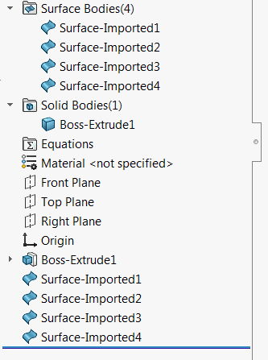

{ width=250 }

该宏使用[SOLIDWORKS API的IModeler::CreateSheetFromFaces](https://help.solidworks.com/2018/english/api/sldworksapi/solidworks.interop.sldworks~solidworks.interop.sldworks.imodeler~createsheetfromfaces.html)方法，为选定的实体或曲面的每个面创建单独的曲面（平面）实体。

~~~ vb
Dim swApp As SldWorks.SldWorks

Sub main()

    Set swApp = Application.SldWorks
    
    Dim swModel As SldWorks.ModelDoc2
    
    Set swModel = swApp.ActiveDoc
    
    If Not swModel Is Nothing Then
        
        Dim swSelMgr As SldWorks.SelectionMgr
        
        Set swSelMgr = swModel.SelectionManager
        
        Dim swBody As SldWorks.Body2
        Set swBody = swSelMgr.GetSelectedObject6(1, -1)
        
        If Not swBody Is Nothing Then
            SplitBodyFaces swModel, swBody
        Else
            MsgBox "Please select body"
        End If
        
    Else
        MsgBox "Please open part"
    End If
    
End Sub

Sub SplitBodyFaces(part As SldWorks.PartDoc, body As SldWorks.Body2)
    
    Dim swModeler As SldWorks.Modeler
    Set swModeler = swApp.GetModeler
    
    Dim vFaces As Variant
    vFaces = body.GetFaces
    
    Dim i As Integer
    
    For i = 0 To UBound(vFaces)
        
        Dim swFace(0) As SldWorks.Face2
        Set swFace(0) = vFaces(i)
        
        Dim swSheetBody As SldWorks.Body2
        Set swSheetBody = swModeler.CreateSheetFromFaces(swFace)
        part.CreateFeatureFromBody3 swSheetBody, True, swCreateFeatureBodyOpts_e.swCreateFeatureBodySimplify
        
    Next
    
End Sub
~~~

要了解更高级的功能（支持参数化方法），请参考[Geomtery++按面分割实体功能](/labs/solidworks/geometry-plus-plus/user-guide/split-body-by-faces/)。