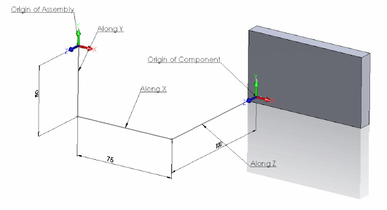

SOLIDWORKS组件是另一个父装配中模型（零件或装配）的实例。组件在其空间中的位置由其转换驱动（无论组件是否受到约束或通过自由拖放操作在空间中移动）。转换由三个组成部分组成：平移、旋转和缩放。

要获取组件的转换，请使用[SOLIDWORKS API属性IComponent2::Transform2](https://help.solidworks.com/2012/english/api/sldworksapi/solidworks.interop.sldworks~solidworks.interop.sldworks.icomponent2~transform2.html)。在这种情况下，转换表示组件原点坐标系与根装配原点坐标系之间的关系。不需要将子装配的转换乘以其子组件的转换，以获得这些组件相对于根装配的总转换。

## 平移转换

在下面的示例中，组件在空间中沿X、Y和Z坐标移动。以下示例将计算组件原点的新位置：

{ width=640 }

~~~ vb
Dim swApp As SldWorks.SldWorks
Dim swMathUtils As SldWorks.MathUtility
Dim swModel As SldWorks.ModelDoc2
Dim swSelMgr As SldWorks.SelectionMgr
Dim swComp As SldWorks.Component2

Sub main()

    Set swApp = Application.SldWorks
    
    Set swMathUtils = swApp.GetMathUtility
    
    Set swModel = swApp.ActiveDoc
    
    Set swSelMgr = swModel.SelectionManager
    
    Set swComp = swSelMgr.GetSelectedObject6(1, -1)
    
    Dim swTransform As SldWorks.MathTransform
    Set swTransform = swComp.Transform2
    
    Dim dOrigPt(2) As Double
    dOrigPt(0) = 0: dOrigPt(1) = 0: dOrigPt(2) = 0
    
    Dim swMathPt As SldWorks.MathPoint
    
    Set swMathPt = swMathUtils.CreatePoint(dOrigPt)
    
    Set swMathPt = swMathPt.MultiplyTransform(swTransform)
    
    Dim vCompOriginPt As Variant

    vCompOriginPt = swMathPt.ArrayData
    
    Debug.Print "Along X: " & vCompOriginPt(0) * 1000 & "mm; " & "Along Y: " & vCompOriginPt(1) * 1000 & "mm; " & "Along Z: " & vCompOriginPt(2) * 1000 & "mm"
    
End Sub
~~~

运行此宏在[此示例模型](transform-translation.SLDASM)上将在监视窗口输出以下行作为结果：

> 沿X轴：75mm；沿Y轴：-50mm；沿Z轴：-100mm

## 旋转转换

现在让我们旋转组件并尝试找到旋转角度。该组件在所有方向上都被旋转。下面的**红线**是装配的X轴，**绿线**是Y轴，**蓝线**是Z轴。New X、New Y和New Z是组件中相应轴的方向，尺寸表示这些轴之间的角度。

{ width=640 }

~~~ vb
Const PI As Double = 3.14159265359

Dim swApp As SldWorks.SldWorks
Dim swMathUtils As SldWorks.MathUtility
Dim swModel As SldWorks.ModelDoc2
Dim swSelMgr As SldWorks.SelectionMgr
Dim swComp As SldWorks.Component2

Sub main()

    Set swApp = Application.SldWorks
    
    Set swMathUtils = swApp.GetMathUtility
    
    Set swModel = swApp.ActiveDoc
    
    Set swSelMgr = swModel.SelectionManager
    
    Set swComp = swSelMgr.GetSelectedObject6(1, -1)
    
    Dim swTransform As SldWorks.MathTransform
    Set swTransform = swComp.Transform2
    
    Debug.Print "Angle between X axes: " & Round(GetAngle(1, 0, 0, swTransform) * 180 / PI, 2) & " deg"
    Debug.Print "Angle between Y axes: " & Round(GetAngle(0, 1, 0, swTransform) * 180 / PI, 2) & " deg"
    Debug.Print "Angle between Z axes: " & Round(GetAngle(0, 0, 1, swTransform) * 180 / PI, 2) & " deg"
    
End Sub

Function GetAngle(x As Double, y As Double, z As Double, transform As SldWorks.MathTransform) As Variant
    
    Dim dVect(2) As Double
    dVect(0) = x: dVect(1) = y: dVect(2) = z
    
    Dim swMathVecOrig As SldWorks.MathVector
    Dim swMathVecTrans As SldWorks.MathVector
    
    Set swMathVecOrig = swMathUtils.CreateVector(dVect)
    
    Set swMathVecTrans = swMathVecOrig.MultiplyTransform(transform)
    
    'cos a= a*b/(|a|*|b|)
    GetAngle = ACos(swMathVecOrig.Dot(swMathVecTrans) / (swMathVecOrig.GetLength() * swMathVecTrans.GetLength()))
    
End Function

Function ACos(val As Double) As Double
    
    If val = 1 Then
        ACos = 0
    ElseIf val = -1 Then
        ACos = 4 * Atn(1)
    Else
        ACos = Atn(-val / Sqr(-val * val + 1)) + 2 * Atn(1)
    End If
    
End Function
~~~

运行上述代码将输出以下结果，适用于[此示例模型](transform-rotation.SLDASM)：

> X轴之间的角度：110度

> Y轴之间的角度：66.74度

> Z轴之间的角度：75度

## 在配置中保留转换状态

默认情况下，浮动组件在配置中的转换状态将被装配修改的另一个配置状态覆盖，例如添加新组件、约束更改等。这与手动行为不同，当另一个配置修改时，浮动组件的位置不会改变。

为了演示这个问题，请考虑以下场景：

* 下载[示例装配](preserve-transform.zip)，其中有一个单独的组件
* 装配中有2个配置
  * 配置**A**通过约束完全定义了组件的位置
  * 配置**B**具有一个浮动组件，在随机位置上没有任何约束
* 运行以下宏。宏将使组件的角与装配的原点对齐在配置B中

* 宏将在几个点停止。阅读指示状态的注释
* 在最后一步中，浮动组件的转换被配置A中的由约束驱动的转换覆盖。

~~~ vb
#If VBA7 Then
     Private Declare PtrSafe Function SendMessage Lib "User32" Alias "SendMessageA" (ByVal hWnd As Long, ByVal wMsg As Long, ByVal wParam As Long, lParam As Any) As Long
#Else
     Private Declare Function SendMessage Lib "User32" Alias "SendMessageA" (ByVal hWnd As Long, ByVal wMsg As Long, ByVal wParam As Long, lParam As Any) As Long
#End If

Dim swApp As SldWorks.SldWorks

Sub main()

    Set swApp = Application.SldWorks
    
    Dim swModel As SldWorks.ModelDoc2
    
    Set swModel = swApp.ActiveDoc
    
    swModel.ShowConfiguration2 "B"
    
    Dim swRootComp As SldWorks.Component2
    Set swRootComp = swModel.ConfigurationManager.ActiveConfiguration.GetRootComponent3(False)
    
    Dim swComp As SldWorks.Component2
    
    Set swComp = swRootComp.GetChildren()(0)
    
    Dim swTransform As SldWorks.MathTransform
    
    Dim dMatrix(15) As Double
    dMatrix(0) = 1: dMatrix(1) = 0: dMatrix(2) = 0: dMatrix(3) = 0
    dMatrix(4) = 1: dMatrix(5) = 0: dMatrix(6) = 0: dMatrix(7) = 0
    dMatrix(8) = 1: dMatrix(9) = -0.03: dMatrix(10) = -0.05: dMatrix(11) = -0.01
    dMatrix(12) = 1: dMatrix(13) = 0: dMatrix(14) = 0: dMatrix(15) = 0
    
    Dim swMathUtils As SldWorks.MathUtility
    
    Set swMathUtils = swApp.GetMathUtility
    
    Set swTransform = swMathUtils.CreateTransform(dMatrix)
    
    swComp.Transform = swTransform
    
    swModel.EditRebuild3
    
    Stop 'Component is aligned
	
    'FixComponentInThisConfiguration swComp
        
    swModel.ShowConfiguration2 "A"
    
    Dim swAssy As SldWorks.AssemblyDoc
    Set swAssy = swModel
    
    swAssy.AddComponent5 swComp.GetPathName(), 0, 0, False, "", 0.2, 0.2, 0.2
    
    swModel.EditRebuild3
    
    Stop 'New component is added into configuration A
	
    swModel.ShowConfiguration2 "B"
	
    Stop 'Component in configuraiton B lost its position
    
End Sub

Sub FixComponentInThisConfiguration(comp As SldWorks.Component2)
    
    If False <> comp.Select4(False, Nothing, False) Then
        Const WM_COMMAND As Long = &H111
        Const CMD_FixCompInThisConf As Long = 51605
        SendMessage swApp.Frame().GetHWnd(), WM_COMMAND, CMD_FixCompInThisConf, 0
    Else
        Err.Raise vbError, "", "Failed to select component"
    End If
    
End Sub
~~~

为了保留转换，需要在配置B中[固定](/solidworks-api/document/assembly/components/fix-float/)组件。

* 取消以下行的注释
* 关闭装配并重新打开

~~~ vb
'FixComponentInThisConfiguration swComp
~~~

改为

~~~ vb
FixComponentInThisConfiguration swComp
~~~

* 再次运行宏。现在转换被保留了