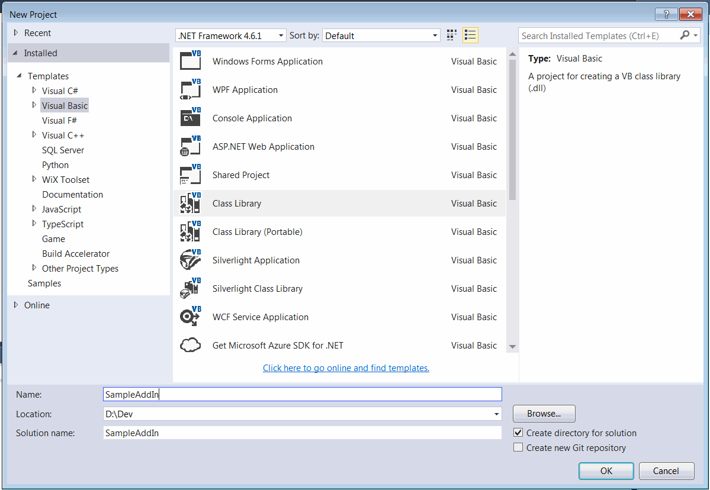
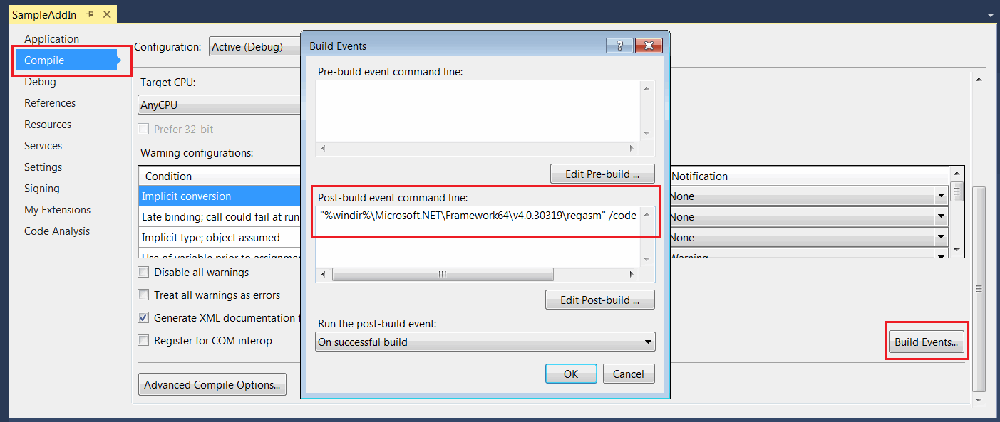
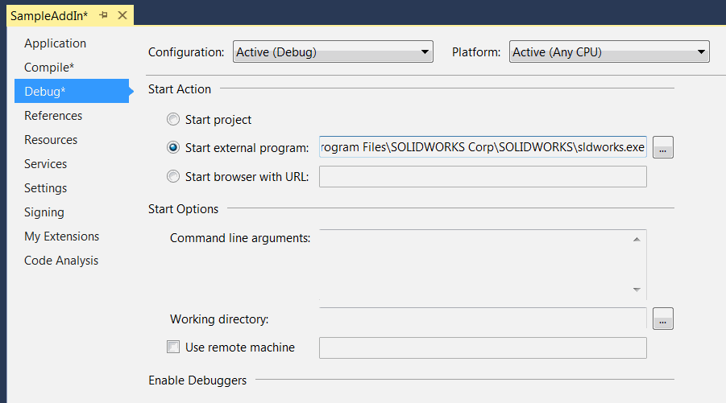
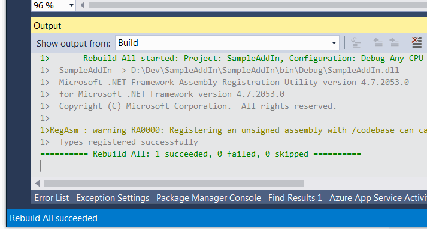

* 在Microsoft Visual Studio中创建新项目
* 在*Visual Basic*模板下选择*类库*模板。指定项目的位置和名称

{ width=550 }

* 添加对SolidWorks Interop库的引用：SolidWorks.Interop.sldworks.dll、SolidWorks.Interop.swconst.dll、SolidWorks.Interop.swpublished.dll。Interop库位于**SOLIDWORKS安装文件夹**\api\redist，用于针对Framework 4.0及更高版本的项目，以及**SOLIDWORKS安装文件夹**\api\redist\CLR2，用于针对Framework 2.0和3.5的项目。

如果项目针对Framework 4.0，则建议将所有SOLIDWORKS interop dlls的**[嵌入互操作类型](https://docs.microsoft.com/en-us/dotnet/framework/interop/type-equivalence-and-embedded-interop-types)**选项设置为false。在某些情况下，嵌入的互操作库会导致类型转换问题，影响功能并可能导致崩溃。

{ width=350 }

* 添加一个公共类，使用友好的名称表示插件。该类必须是公共的和COM可见的。建议使用[ComVisibleAttribute](https://docs.microsoft.com/en-us/dotnet/api/system.runtime.interopservices.comvisibleattribute?view=netframework-4.7.2)和[GuidAttribute](https://docs.microsoft.com/en-gb/dotnet/api/system.runtime.interopservices.guidattribute?view=netframework-4.7.2)修饰该类，以将类型公开给COM并分配永久的全局唯一标识符（GUID）：

~~~ vb
<ComVisible(True)>
<Guid("799707B3-1632-469F-B294-EC05A5FBFFC8")>
Public Class MySampleAddin
	Implements ISwAddin
    ...
End Class
~~~

避免在项目设置中选择*使程序集对COM可见*选项以将类型公开给COM，只需使用上述描述的属性将所需的类标记为COM可见。

* 插件dll必须使用/codebase标志进行注册。项目设置中的*注册COM互操作性*选项在注册时不使用此选项，因此在这种情况下不适用，此外，此选项将在32位注册表中注册类型，而SOLIDWORKS需要在64位注册表中注册条目。相反，添加以下后期构建操作：

~~~ bat
"%windir%\Microsoft.NET\Framework64\v4.0.30319\regasm" /codebase "$(TargetPath)"
~~~

这将确保在每次编译插件项目后进行正确的注册。

* 为了获得更好的调试体验，建议在项目设置中指定SOLIDWORKS的完整路径作为外部应用程序。

这将通过按下绿色运行按钮或F5键自动启动SOLIDWORKS，并从Visual Studio附加调试器。

* 需要向SOLIDWORKS注册表分支添加注册信息，以使其对应用程序可见。为了简化这个过程，可以通过定义函数并使用[ComRegisterFunctionAttribute](https://docs.microsoft.com/en-us/dotnet/api/system.runtime.interopservices.comregisterfunctionattribute?view=netframework-4.7.2)和[ComUnregisterFunctionAttribute](https://docs.microsoft.com/en-us/dotnet/api/system.runtime.interopservices.comunregisterfunctionattribute?view=netframework-4.7.2)属性对它们进行自动添加和删除。

* 复制下面显示的插件代码并编译项目

~~~ vb
Imports SolidWorks.Interop.sldworks
Imports SolidWorks.Interop.swpublished
Imports System
Imports System.ComponentModel
Imports System.Diagnostics
Imports System.Linq
Imports System.Runtime.InteropServices

<ComVisible(True)>
<Guid("799707B3-1632-469F-B294-EC05A5FBFFC8")>
<DisplayName("Sample Add-In")>
<Description("Sample 'Hello World' SOLIDWORKS add-in")>
Public Class MySampleAddin
    Implements ISwAddin

    Private Const ADDIN_KEY_TEMPLATE As String = "SOFTWARE\SolidWorks\Addins\{{{0}}}"
    Private Const ADDIN_STARTUP_KEY_TEMPLATE As String = "Software\SolidWorks\AddInsStartup\{{{0}}}"
    Private Const ADD_IN_TITLE_REG_KEY_NAME As String = "Title"
    Private Const ADD_IN_DESCRIPTION_REG_KEY_NAME As String = "Description"

#Region "Registration"

    <ComRegisterFunction>
    Public Shared Sub RegisterFunction(ByVal t As Type)
        Try
            Dim addInTitle = ""
            Dim loadAtStartup = True
            Dim addInDesc = ""
            Dim dispNameAtt = t.GetCustomAttributes(False).OfType(Of DisplayNameAttribute)().FirstOrDefault()

            If dispNameAtt IsNot Nothing Then
                addInTitle = dispNameAtt.DisplayName
            Else
                addInTitle = t.ToString()
            End If

            Dim descAtt = t.GetCustomAttributes(False).OfType(Of DescriptionAttribute)().FirstOrDefault()

            If descAtt IsNot Nothing Then
                addInDesc = descAtt.Description
            Else
                addInDesc = t.ToString()
            End If

            Dim addInkey = Microsoft.Win32.Registry.LocalMachine.CreateSubKey(String.Format(ADDIN_KEY_TEMPLATE, t.GUID))
            addInkey.SetValue(Nothing, 0)
            addInkey.SetValue(ADD_IN_TITLE_REG_KEY_NAME, addInDesc)
            addInkey.SetValue(ADD_IN_DESCRIPTION_REG_KEY_NAME, addInTitle)
            Dim addInStartupkey = Microsoft.Win32.Registry.CurrentUser.CreateSubKey(String.Format(ADDIN_STARTUP_KEY_TEMPLATE, t.GUID))
            addInStartupkey.SetValue(Nothing, Convert.ToInt32(loadAtStartup), Microsoft.Win32.RegistryValueKind.DWord)
        Catch ex As Exception
            Console.WriteLine("Error while registering the addin: " & ex.Message)
        End Try

    End Sub

    <ComUnregisterFunction>
    Public Shared Sub UnregisterFunction(ByVal t As Type)
        Try
            Microsoft.Win32.Registry.LocalMachine.DeleteSubKey(String.Format(ADDIN_KEY_TEMPLATE, t.GUID))
            Microsoft.Win32.Registry.CurrentUser.DeleteSubKey(String.Format(ADDIN_STARTUP_KEY_TEMPLATE, t.GUID))
        Catch e As Exception
            Console.WriteLine("Error while unregistering the addin: " & e.Message)
        End Try
    End Sub
#End Region

    Private m_App As ISldWorks

    Public Function ConnectToSW(ByVal ThisSW As Object, ByVal Cookie As Integer) As Boolean Implements ISwAddin.ConnectToSW
        m_App = TryCast(ThisSW, ISldWorks)
        m_App.SendMsgToUser("Hello World!")
        Return True
    End Function

    Public Function DisconnectFromSW() As Boolean Implements ISwAddin.DisconnectFromSW
        Return True
    End Function

End Class

~~~

* 可以忽略在Visual Studio窗口中显示的以下警告。

{ width=450 }

* 运行SOLIDWORKS，启动时将显示*Hello World*消息框。

可以使用[xCAD.NET Framework](https://xcad.net/)框架简化上述代码，如下所示：

~~~ vb
<Title("Sample Add-In")>
<Description("Sample 'Hello World' SOLIDWORKS add-in")>
<ComVisible(True), Guid("799707B3-1632-469F-B294-EC05A5FBFFC8")>
Public Class MySampleAddIn
    Inherits SwAddInEx

    Public Overrides Sub OnConnect()
    End Sub

End Class
~~~