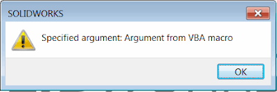

标题：通过剪贴板将参数传递给SOLIDWORKS VBA宏
说明：通过剪贴板
描述：从.NET应用程序或另一个宏通过剪贴板将自定义字符串参数传递给VBA宏
图片：msg-box-macro-argument.png
标签：[参数，剪贴板，示例，参数，solidworks api]
重定向自：
  - /2018/04/pass-arguments-to-vba-macro-via-clipboard.html
---
系统剪贴板可以存储不同类型的数据（包括但不限于文本、图像、HTML等）。最简单的方法是将自定义参数写入文本缓冲区，但这将清除缓冲区中已有的所有数据（如果有的话）。这可能会引起混淆，并导致用户体验不佳，因为运行宏可能会覆盖已复制到剪贴板的文本。

另一种方法是将数据写入具有唯一名称的自定义缓冲区，以便它不会明确地暴露给用户，并且只能通过代码访问。

让我们从“目标”宏开始，该宏将从不同的“主”宏中调用。

~~~ vb
Dim swApp As SldWorks.SldWorks

Sub main()
        
    Set swApp = Application.SldWorks
        
     swApp.SendMsgToUser "Specified argument: " & ArgumentHelper.GetArgument()
    
End Sub
~~~

上面的示例中，从“主”宏传递的参数值将在“目标”宏中提取并显示给用户的消息框中：

{ width=400 height=132 }

助手类从**__SwMacroArgs__**格式中读取缓冲区值。这是一个已知于“主”宏（将写入参数值）和“目标”宏（将读取值）的自定义名称。如果需要，可以将其重命名为任何其他自定义名称。

~~~ vb
Const ARG_FORMAT = "__SwMacroArgs__"

Private Declare PtrSafe Function RegisterClipboardFormat Lib "User32" Alias "RegisterClipboardFormatA" (ByVal lpString As String) As LongPtr
Private Declare PtrSafe Function OpenClipboard Lib "User32" (ByVal hwnd As LongPtr) As Long
Private Declare PtrSafe Function GetClipboardData Lib "User32" (ByVal wFormat As LongPtr) As LongPtr
Private Declare PtrSafe Function GlobalSize Lib "kernel32" (ByVal hClipMemory As LongPtr) As Long
Private Declare PtrSafe Function GlobalLock Lib "kernel32" (ByVal hClipMemory As LongPtr) As LongPtr
Private Declare PtrSafe Sub CopyMemory Lib "kernel32" Alias "RtlMoveMemory" (lpvDest As Any, lpvSource As Any, ByVal cbCopy As LongPtr)
Private Declare PtrSafe Function GlobalUnlock Lib "kernel32" (ByVal hClipMemory As LongPtr) As Long
Private Declare PtrSafe Function CloseClipboard Lib "User32" () As Long

Public Function GetArgument() As String
    
    On Error GoTo ErrorHandler
    
    Dim hClipMemory As LongPtr
    Dim lSize As Long
    Dim lpClipMemory As LongPtr
    Dim wFormat As LongPtr
    
    wFormat = RegisterClipboardFormat(ARG_FORMAT)
    
    If OpenClipboard(0&) = 0 Then
        RaiseError "Failed to open clipboard"
    End If
            
    hClipMemory = GetClipboardData(wFormat)
        
    If hClipMemory > 0 Then
        
        lSize = GlobalSize(hClipMemory)
        
        If lSize > 0 Then
        
            lpClipMemory = GlobalLock(hClipMemory)
            
            If lpClipMemory > 0 Then
                
                Dim bData() As Byte
                ReDim bData(lSize - 1) As Byte
                
                CopyMemory bData(0), ByVal lpClipMemory, lSize
                
                GlobalUnlock hClipMemory

                GetArgument = Trim(StrConv(bData, vbUnicode))

            End If
            
        End If
    
    Else
        RaiseError "No argument specified"
    End If
    
    GoTo Finally
    
ErrorHandler:
    MsgBox "Critical Error: " & Err.Description

Finally:
    CloseClipboard 'must close the clipboard otherswise memory leak
    
End Function

Sub RaiseError(desc As String)
    
    Const SYS_ERR_OFFSET As Integer = 513
    
    Err.Raise Number:=vbObjectError + SYS_ERR_OFFSET, _
              Description:=desc
End Sub
~~~

为了调用宏并传递参数，需要将**__SwMacroArgs__**格式的缓冲区值设置为Unicode字符串。以下是演示如何在不同的编程语言中实现此目的的示例：

VBA宏

参数助手模块

~~~ vb
Const ARG_FORMAT = "__SwMacroArgs__"

Const GHND As Integer = &H42

Private Declare PtrSafe Function RegisterClipboardFormat Lib "User32" Alias "RegisterClipboardFormatA" (ByVal lpString As String) As LongPtr
Private Declare PtrSafe Function GlobalAlloc Lib "kernel32" (ByVal wFlags As LongPtr, ByVal dwBytes As LongPtr) As Long
Private Declare PtrSafe Function GlobalLock Lib "kernel32" (ByVal hMem As LongPtr) As Long
Private Declare PtrSafe Function lstrcpy Lib "kernel32" (ByVal lpString1 As Any, ByVal lpString2 As Any) As Long
Private Declare PtrSafe Function GlobalUnlock Lib "kernel32" (ByVal hMem As LongPtr) As Long
Private Declare PtrSafe Function OpenClipboard Lib "User32" (ByVal hwnd As LongPtr) As Long
Private Declare PtrSafe Function CloseClipboard Lib "User32" () As Long
Private Declare PtrSafe Function SetClipboardData Lib "User32" (ByVal wFormat As LongPtr, ByVal hMem As LongPtr) As Long

Public Sub SetArgument(arg As String)
    
    On Error GoTo ErrorHandler
        
    Dim wFormat As LongPtr
    
    wFormat = RegisterClipboardFormat(ARG_FORMAT)
    
    Dim hGlobalMemory As Long
    Dim lpGlobalMemory As Long
        
    hGlobalMemory = GlobalAlloc(GHND, Len(arg))
    lpGlobalMemory = GlobalLock(hGlobalMemory)
    lpGlobalMemory = lstrcpy(lpGlobalMemory, arg)

    If GlobalUnlock(hGlobalMemory) <> 0 Then
        RaiseError "Failed to unlock memory"
    End If

    If OpenClipboard(0&) = 0 Then
        RaiseError "Failed to open clipboard"
    End If

    SetClipboardData wFormat, hGlobalMemory
    
    GoTo Finally
    
ErrorHandler:
    MsgBox "Critical Error: " & err.Description

Finally:
    CloseClipboard
    
End Sub

Sub RaiseError(desc As String)
    
    Const SYS_ERR_OFFSET As Integer = 513
    
    err.Raise Number:=vbObjectError + SYS_ERR_OFFSET, _
              Description:=desc
End Sub
~~~

宏

~~~ vb
Dim swApp As SldWorks.SldWorks

Sub main()
    
    Set swApp = Application.SldWorks
    
    ArgumentHelper.SetArgument "Argument from VBA macro"
    
    Dim err As Long
    
    If False = swApp.RunMacro2("D:\Macros\GetArgumentMacro.swp", _
        "Macro1", "main", swRunMacroOption_e.swRunMacroUnloadAfterRun, err) Then
        
        swApp.SendMsgToUser "Failed to run macro. Error code: " & err
        
    End If
    
End Sub
~~~

C#

~~~ cs
using SolidWorks.Interop.sldworks;
using SolidWorks.Interop.swconst;
using System.Runtime.InteropServices;
using System;
using System.Windows.Forms;
using System.Text;
using System.IO;

namespace CodeStack
{
    public partial class SolidWorksMacro
    {
        const string ARG_NAME = "__SwMacroArgs__";

        public void Main()
        {
            SetArgument("Argument from C# macro");

            int err;
            if (!swApp.RunMacro2(@"D:\Macros\GetArgumentMacro.swp",
                "Macro1", "main", (int)swRunMacroOption_e.swRunMacroUnloadAfterRun, out err))
            {
                swApp.SendMsgToUser(string.Format("Failed to run macro. Error code: {0}", err));
            }
        }

        private static void SetArgument(string arg)
        {
            using (MemoryStream stream = new MemoryStream(Encoding.UTF8.GetBytes(arg)))
            {
                Clipboard.SetData(ARG_NAME, stream);
            }
        }

        public SldWorks swApp;
    }
}

~~~

VB.NET

~~~ vb
Imports SolidWorks.Interop.sldworks
Imports SolidWorks.Interop.swconst
Imports System.Runtime.InteropServices
Imports System.IO
Imports System.Windows.Forms
Imports System.Text
Imports System

Partial Class CodeStack

    Const ARG_NAME As String = "__SwMacroArgs__"

    Public Sub Main()
        SetArgument("Argument from VB.NET macro")
        Dim err As Integer
        If Not swApp.RunMacro2("D:\Macros\GetArgumentMacro.swp", "Macro1", "main", CInt(swRunMacroOption_e.swRunMacroUnloadAfterRun), err) Then
            swApp.SendMsgToUser(String.Format("Failed to run macro. Error code: {0}", err))
        End If
    End Sub

    Private Shared Sub SetArgument(ByVal arg As String)
        Using stream As MemoryStream = New MemoryStream(Encoding.UTF8.GetBytes(arg))
            Clipboard.SetData(ARG_NAME, stream)
        End Using
    End Sub

    Public swApp As SldWorks

End Class

~~~

> 注意：上述示例不处理“竞争条件”（当多个具有不同参数的宏可能并行运行时）。使用互斥体或信号量对象来同步对共享资源的访问。