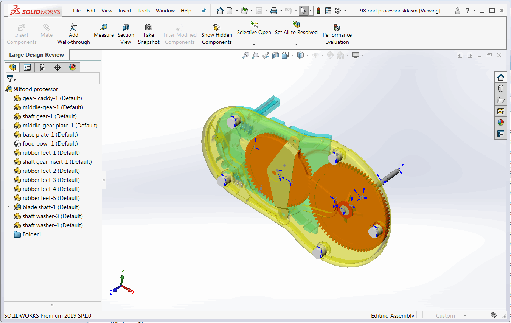
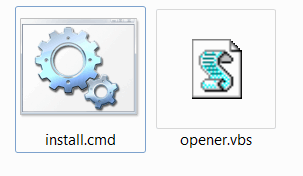
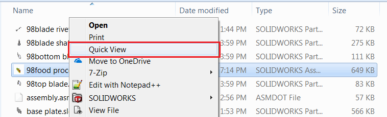

{ width=450 }

SOLIDWORKS提供了一种选项，可以以[大型设计审查](https://help.solidworks.com/2018/English/SolidWorks/sldworks/HIDD_DIALOG_LDR_WARNING.htm)模式（也称为快速查看）打开大型装配或绘图。这样可以仅加载装配和绘图的视觉信息，从而显著提高性能（大型装配通常只需几秒钟即可打开，而不是几分钟甚至几小时）。可以随后按需加载各个组件。

{ width=650 }

然而，从Windows文件资源管理器打开文档时不支持此模式。

以下指南说明如何直接从Windows文件资源管理器启用快速查看模式。

* 创建一个新文件夹，其中包含用于以快速查看模式打开文件的脚本
* 创建一个扩展名为.vbs的文本文件，并将其命名为*opener.vbs*
* 将以下代码粘贴到此文件中

~~~ vbs
Dim swApp
Set swApp = CreateObject("SldWorks.Application")
swApp.Visible = True

Dim filePath
filePath = WScript.Arguments.Item(0)

If filePath <> "" then

	Dim docSpec
	Set docSpec = swApp.GetOpenDocSpec(filePath)
	docSpec.ViewOnly = True

	Dim swModel
	Set swModel = swApp.OpenDoc7(docSpec)

	If swModel is Nothing Then
		MsgBox "Failed to open document"
	End If
	
Else
	MsgBox "File path is not specified"
End If
~~~

* 创建另一个文本文件，并将其命名为*install.cmd*
* 在*install.cmd*中添加以下行，以启用装配的快速模式

~~~ bat
reg add "HKCR\SldAssem.Document\shell\Quick View\command" /ve /d "wscript.exe """%~dp0opener.vbs""" ""%%1""" /f
~~~

* 如果要启用绘图的快速查看模式，还需添加以下行

~~~ bat
reg add "HKCR\SldDraw.Document\shell\Quick View\command" /ve /d "wscript.exe """%~dp0opener.vbs""" ""%%1""" /f
~~~

* 保存这两个文件。重要的是将这些文件保存在同一个文件夹中

{ width=250 }

* 运行*install.cmd*。您可能需要以管理员身份运行此命令

结果是将*快速查看*上下文菜单命令添加到Windows文件资源管理器中。选择任何装配，点击鼠标右键。点击快速查看，文件将以SOLIDWORKS的快速查看模式打开：

{ width=450 }

观看[视频演示](https://youtu.be/9uZCecGg25I?t=12)