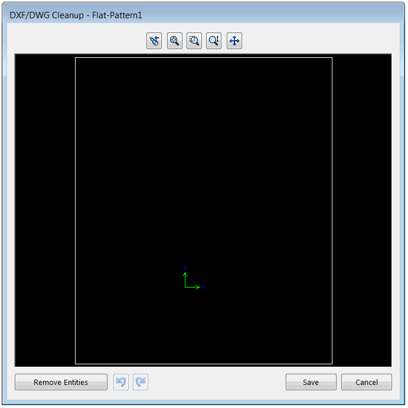

[SOLIDWORKS API方法IPartDoc::ExportToDwg2](https://help.solidworks.com/2014/english/api/sldworksapi/SolidWorks.Interop.sldworks~SolidWorks.Interop.sldworks.IPartDoc~ExportToDWG2.html)允许将选定的平面图案导出为DXF/DWG格式。但是该API不允许在导出之前显示内置的清理对话框以修改DXF/DWG。

{ width=350 }

下面的代码提供了解决此问题的方法。

> 注意：此代码不允许设置导出的设置（使用默认选项）。需要使用Windows API来修改选项和复选框。

## 配置

按照下面的示例指定宏参数：

~~~vb
Const FLAT_PATTERN_FEAT_NAME As String = "Flat-Pattern1" '要导出的平面图案特征的名称
Const OUT_FILE_NAME As String = "D:\sample.dxf" '导出的输出文件名
~~~

## 宏模块

~~~ vb
#If VBA7 Then
     Private Declare PtrSafe Function SendMessage Lib "User32" Alias "SendMessageA" (ByVal hWnd As Long, ByVal wMsg As Long, ByVal wParam As Long, lParam As Any) As Long
#Else
     Private Declare Function SendMessage Lib "User32" Alias "SendMessageA" (ByVal hWnd As Long, ByVal wMsg As Long, ByVal wParam As Long, lParam As Any) As Long
#End If

Const FLAT_PATTERN_FEAT_NAME As String = "Flat-Pattern1"
Const OUT_FILE_NAME As String = "D:\sample.dxf"

Dim swApp As SldWorks.SldWorks

Sub main()

    Set swApp = Application.SldWorks
    
    Dim swPart As SldWorks.PartDoc
    Set swPart = swApp.ActiveDoc
    
    If Not swPart Is Nothing Then
        
        Dim swFeat As SldWorks.Feature
        Set swFeat = swPart.FeatureByName(FLAT_PATTERN_FEAT_NAME)
        
        If Not swFeat Is Nothing Then
            ExportFlatPattern swPart, swFeat, OUT_FILE_NAME
        Else
            MsgBox "Failed to find the flat pattern feature"
        End If
        
    Else
        MsgBox "Please open part document"
    End If
        
End Sub

Sub ExportFlatPattern(Part As SldWorks.PartDoc, feat As SldWorks.Feature, fileName As String)
                    
    Dim swEvListener As ExportEventsListener
    Set swEvListener = New ExportEventsListener
    
    'Set the file name for the exported DXF/DWG file
    Set swEvListener.Part = Part
    swEvListener.FilePath = fileName
    
    feat.Select2 False, 0
    
    'Call the Export command
    Const WM_COMMAND As Long = &H111
    Const CMD_ExportFlatPattern As Long = 54244
    SendMessage swApp.Frame().GetHWnd(), WM_COMMAND, CMD_ExportFlatPattern, 0
    
    'wait for property page to be displayed
    Dim isActive As Boolean
    
    Do
        swApp.GetRunningCommandInfo -1, "", isActive
        DoEvents
    Loop While Not isActive
    
    Set swEvListener.Part = Nothing

    'TODO: call Windows API to set the required options in the property page
    
    'close property page
    Const swCommands_PmOK As Long = -2
    swApp.RunCommand swCommands_PmOK, ""
    
End Sub
~~~

## ExportEventsListener 类模块

创建一个名为**ExportEventsListener**的新[类模块](/visual-basic/classes/)，并添加下面的代码

~~~ vb
Public WithEvents Part As SldWorks.PartDoc
Public FilePath As String

Private Function Part_FileSaveAsNotify2(ByVal fileName As String) As Long
    
    Dim swModel As SldWorks.ModelDoc2
    Set swModel = Part
    
    swModel.SetSaveAsFileName FilePath
    Part_FileSaveAsNotify2 = 1
    
End Function
~~~

