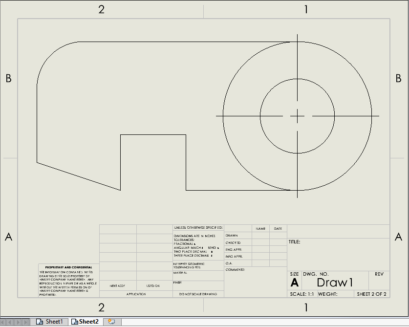

{ width=500 }

这个VBA宏允许将活动的SOLIDWORKS图纸中的所有工作表（或选定的工作表）导出为单独的PDF文件。如果没有选择工作表，则会导出所有工作表。

PDF文件保存在与原始图纸相同的文件夹中，并以工作表的名称命名。

*INCLUDE_DRAWING_NAME*选项允许在输出PDF中包含图纸的名称，如果设置为*True*，否则只使用工作表的名称。

~~~ vb jagged-bottom
Const INCLUDE_DRAWING_NAME As Boolean = True '包含图纸的名称
~~~

~~~ vb
Const INCLUDE_DRAWING_NAME As Boolean = True

Dim swApp As SldWorks.SldWorks

Sub main()

    Set swApp = Application.SldWorks
    
try_:
    
    On Error GoTo catch_
    
    Dim swDraw As SldWorks.DrawingDoc
    
    Set swDraw = swApp.ActiveDoc
    
    Dim swModel As SldWorks.ModelDoc2
    Set swModel = swDraw
        
    If swModel.GetPathName() = "" Then
        Err.Raise vbError, "", "Please save drawing"
    End If
        
    Dim vSheetNames As Variant
    
    Dim i As Integer
    
    Dim swSelMgr As SldWorks.SelectionMgr
    
    Set swSelMgr = swModel.SelectionManager
    
    Dim selSheetNames() As String
    
    For i = 1 To swSelMgr.GetSelectedObjectCount2(-1)
        
        If swSelMgr.GetSelectedObjectType3(i, -1) = swSelectType_e.swSelSHEETS Then
            
            If (Not selSheetNames) = -1 Then
                ReDim selSheetNames(0)
            Else
                ReDim Preserve selSheetNames(UBound(selSheetNames) + 1)
            End If
            Dim swSheet As SldWorks.Sheet
            Set swSheet = swSelMgr.GetSelectedObject6(i, -1)
            
            selSheetNames(UBound(selSheetNames)) = swSheet.GetName()
            
        End If
    Next
    
    If (Not selSheetNames) = -1 Then
        vSheetNames = swDraw.GetSheetNames
    Else
        vSheetNames = selSheetNames
    End If
    
    For i = 0 To UBound(vSheetNames)
        
        Dim sheetName As String
        sheetName = vSheetNames(i)
        
        Dim swExpPdfData As SldWorks.ExportPdfData
        Set swExpPdfData = swApp.GetExportFileData(swExportDataFileType_e.swExportPdfData)
        
        Dim errs As Long
        Dim warns As Long
        
        Dim expSheets(0) As String
        expSheets(0) = sheetName
        
        swExpPdfData.ExportAs3D = False
        swExpPdfData.ViewPdfAfterSaving = False
        swExpPdfData.SetSheets swExportDataSheetsToExport_e.swExportData_ExportSpecifiedSheets, expSheets
        
        Dim drawName As String
        drawName = swModel.GetPathName()
        drawName = Mid(drawName, InStrRev(drawName, "\") + 1, Len(drawName) - InStrRev(drawName, "\") - Len(".slddrw"))
        
        Dim outFile As String
        outFile = swModel.GetPathName()
        outFile = Left(outFile, InStrRev(outFile, "\"))
        outFile = outFile & IIf(INCLUDE_DRAWING_NAME, drawName & "_", "") & sheetName & ".pdf"
        
        If False = swModel.Extension.SaveAs(outFile, swSaveAsVersion_e.swSaveAsCurrentVersion, swSaveAsOptions_e.swSaveAsOptions_Silent, swExpPdfData, errs, warns) Then
            Err.Raise vbError, "", "Failed to export PDF to " & outFile
        End If
        
    Next
    
    
    GoTo finally_
    
catch_:
    
    swApp.SendMsgToUser2 Err.Description, swMessageBoxIcon_e.swMbStop, swMessageBoxBtn_e.swMbOk
    
finally_:
    
End Sub
~~~

