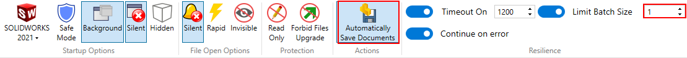

作者：[Eddy Alleman](https://www.linkedin.com/in/eddyalleman/) ([EDAL Solutions](https://www.edalsolutions.be/index.php/en/))

{ width=400 }

## 上下文情境：

假设我们有数百个STEP文件，都在供应商的同一个文件夹中。
我们想要建立一个库，以便在设计中反复重用它们。
为了将文件彼此分开，我们希望每个STEP文件都导出到一个单独的文件夹中。

## SOLIDWORKS有一个工具可以实现这个目标：任务计划程序

{ width=350 }

但是，除非我们首先将STEP文件放入单独的文件夹中，然后将导出的SOLIDWORKS文件保存到这些子文件夹中，否则所有的STEP文件都将保存在同一个文件夹中。
这需要大量的手动工作。

此外，我们无法确定是否存在重复文件以及这些文件是否具有不同的详细级别。
我们希望在导入后能够选择最好的文件，而不仅仅是覆盖已处理的文件。

那么，我们如何自动化这个过程，避免手动创建所有这些子文件夹呢？

## 使用简单宏的批处理+

批处理+是CAD+的一部分，是一个免费工具，它处理批处理文件时处理了许多特殊情况。
我们选择这个选项是因为它易于设置，并且可以完全控制整个过程。

以下宏确定了STEP文件是装配件还是零件文件。
如果是装配件，则组件将保存为单独的零件文件（取决于系统选项，请参见上面的图像）。

该宏在与STEP文件相同的位置创建一个子文件夹，并使用相同的名称。
这有助于将属于同一组的文件与其他导入文件分开。
如果您不每次都将它们放在新文件夹中，可能会得到相同的文件两次，并且最后一次保存会覆盖之前的文件。在这种情况下，请确保它们是相同的。

## 先决条件

（1）确保您的系统选项未设置为：
    提示用户选择文档模板
    而是使用："始终使用这些默认文档模板"
否则，SolidWorks会一直要求选择文档模板。

（2）设置系统选项 > 导入 > 启用3D互连关闭
    关于3D互连的文档：
    直接将专有CAD数据插入到SOLIDWORKS装配中，而无需将其转换为SOLIDWORKS文件。
    而我们正是要进行转换。3D互连只是创建了一个指向STEP文件的链接，并在需要时进行更新。

{ width=800 }

~~~ vb
Option Explicit

'Overwrites if solidworks files already exist in case they have been processed before.
Const OVERWRITE As Boolean = False

'set the path you want to save to
Const DESTINATION_PATH As String = "C:\temp"

Sub main()

try_:

    'Uncomment the following line if you want to debug into this code during running Batch+
    'Debug.Assert False
    
    On Error GoTo catch_
    
    'test if DESTINATION PATH exists
    If FolderExists(DESTINATION_PATH) Then

        Dim swApp As SldWorks.SldWorks
        Set swApp = Application.SldWorks
        
        'You have to open a step file first, without saving it if you want to test without Batch+
        Dim swModel As SldWorks.ModelDoc2
        Set swModel = swApp.ActiveDoc
        
        If Not swModel Is Nothing Then
                    
             '--- Get file name without extension and path
             'only get the document name (which is displayed in the title bar of SolidWorks)
             Dim swxFilenaam As String
             swxFilenaam = swModel.GetTitle
             
             '--- Get file extension
             'Determine if the step file was an assembly or a part file to set the file extension correctly
             Dim Extension As String
             Select Case swModel.GetType
                
                Case swDocPART:
                    Extension = ".SLDPRT"
                
                Case swDocASSEMBLY:
                    Extension = ".SLDASM"
                    
             End Select
            
            '--- Get path
             Dim newPath As String
             newPath = DESTINATION_PATH
          
             
            'Add the name of the subfolder
             Dim subfoldername As String            
             subfoldername = "\" + swxFilenaam + "\"
             newPath = DESTINATION_PATH + subfoldername    
            
            '--- if folder doesn't exist already create it
             CreateFolderIfNotExisting (newPath)
            
            '--- Create the name of the file to save to
            swxFilenaam = newPath + swxFilenaam + Extension
            
            '--- if swxFilenaam exists already and OVERWRITE = False
            If FileExists(swxFilenaam) And OVERWRITE = False Then
                'do nothing
            Else
        
                ' make sure nothing is selected, otherwise only selected entities are saved
                swModel.ClearSelection2 False
        
        '--- save the step file
                Dim lErrors As Long
                Dim lWarnings As Long
                Dim boolstatus As Boolean
                boolstatus = swModel.Extension.SaveAs(swxFilenaam, 0, swSaveAsOptions_e.swSaveAsOptions_Silent, Nothing, lErrors, lWarnings)
                Debug.Assert boolstatus
                                      
                'swApp.CloseDoc (swxFilenaam)'don't use it , let Batch+ handle it
             
             End If 'File exists already
             
        Else
            
            MsgBox "No document open"
            
        End If 'swModel Nothing
    
    Else
    
        MsgBox DESTINATION_PATH + "doesn't exist"
        
    End If 'DESTINATION_PATH exists
    
catch_:

    Debug.Print "Error: " & Err.Number & ":" & Err.source & ":" & Err.Description
    GoTo finally_
    
finally_:
    Debug.Print "FINISHED MACRO ImportStep"
    
End Sub

Function CreateFolderIfNotExisting(newPath As String)

    If FolderExists(newPath) Then
         'do nothing
    Else
        MkDir (newPath)
        Debug.Print "Path created : " + newPath
    End If

End Function

Function FolderExists(newPath As String) As Boolean

    If Dir(newPath, vbDirectory) = "" Then
        Debug.Print "Path doesn't exist : " + newPath
        FolderExists = False
    Else
        Debug.Print "Path exists : " + newPath
        FolderExists = True
    End If

End Function

Function FileExists(newPath As String) As Boolean

    If Dir(newPath) = "" Then
        Debug.Print "File doesn't exist : " + newPath
        FileExists = False
    Else
        Debug.Print "File exists : " + newPath
        FileExists = True
    End If

End Function

~~~

