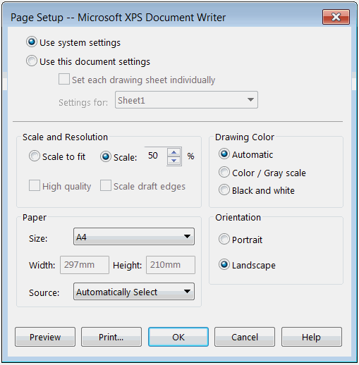

{ width=350 }

本示例演示了如何使用SOLIDWORKS API更改系统页面设置选项（纸张大小和比例），并将当前文档选项设置为使用系统设置。

此示例还演示了如何通过指定纸张名称来检索[IPageSetup::PrinterPaperSize](https://help.solidworks.com/2016/english/api/sldworksapi/SolidWorks.Interop.sldworks~SolidWorks.Interop.sldworks.IPageSetup~PrinterPaperSize.html)的系统特定纸张大小整数。

~~~ vb
Private Declare PtrSafe Function DeviceCapabilities Lib "winspool.drv" Alias "DeviceCapabilitiesA" (ByVal lpDeviceName As String, ByVal lpPort As String, ByVal iIndex As Long, ByRef lpOutput As Any, ByRef lpDevMode As Any) As Long

Const PAPER_NAME As String = "A4"

Dim swApp As SldWorks.SldWorks

Sub main()

    Set swApp = Application.SldWorks
    Dim swModel As SldWorks.ModelDoc2
    
    Set swModel = swApp.ActiveDoc
    
    If Not swModel Is Nothing Then
        
        Dim swAppPageSetup As SldWorks.PageSetup
        Set swAppPageSetup = swModel.Extension.AppPageSetup
        
        swAppPageSetup.PrinterPaperSize = GetPaper(swModel.Printer, PAPER_NAME)
        swAppPageSetup.ScaleToFit = False
        swAppPageSetup.Scale2 = 50
        
        swModel.Extension.UsePageSetup = swPageSetupInUse_e.swPageSetupInUse_Application
        
    Else
        MsgBox "Please open the model"
    End If
    
End Sub

Public Function GetPaper(printerName As String, paperName As String) As Integer
    
    Const DC_PAPERNAMES As Integer = &H10
    Const DC_PAPERS As Integer = &H2
    
    Dim papersCount As Integer
    papersCount = DeviceCapabilities(printerName, "", DC_PAPERS, ByVal vbNullString, 0)
    
    If papersCount > 0 Then
    
        Dim papersCodes() As Integer
        ReDim papersCodes(papersCount - 1)
        
        DeviceCapabilities printerName, "", DC_PAPERS, papersCodes(0), 0
        
        Dim papersNames As String
        papersNames = String$(64 * papersCount, 0)
        DeviceCapabilities printerName, "", DC_PAPERNAMES, ByVal papersNames, 0
      
        Dim i As Integer
        
        For i = 0 To papersCount
            If LCase(ParsePaperName(papersNames, 64 * i + 1)) = LCase(paperName) Then
                GetPaper = papersCodes(i)
            End If
        Next
    Else
        Err.Raise vbError, "", "No sizes available for the specified printer"
    End If
    
End Function

Function ParsePaperName(papersNames As String, offset As Integer) As String

    Dim paperName As String
    
    paperName = Mid(papersNames, offset, 64)
    
    Dim nullCharIndex As Integer
    nullCharIndex = InStr(paperName, vbNullChar)
    
    If nullCharIndex <> 0 Then
        paperName = Left$(paperName, nullCharIndex - 1)
    End If
     
    ParsePaperName = paperName
    
End Function
~~~

