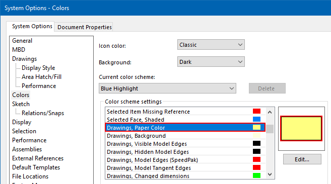

作者：[Eddy Alleman](https://www.linkedin.com/in/eddyalleman/) ([EDAL Solutions](https://www.edalsolutions.be/index.php/en/))

{ width=450 }

介绍
在SolidWorks论坛上，有人问如何制作一个宏，可以在默认绘图背景颜色和白色之间切换。
目标是使捕捉需要白色背景的图像更加容易。

这是一个简单的宏，可以实现这个目标。我还会解释您需要的基本按钮/快捷键/菜单。

如果您想在其他颜色之间切换，可以在下面的Color1和Color2常量中进行更改。

## 但是我们如何得到与我们想要的颜色对应的数字呢？
只需在SolidWorks选项中手动更改为您喜欢的颜色（在上面的图像中，我选择了一种更加鲜明的黄色）
然后使用宏编辑器打开宏（菜单工具 > 宏 > 编辑，或使用宏工具栏）。
如果立即窗口尚未可见，请打开它（CTRL + G）
运行宏（F5或绿色箭头按钮），在立即窗口中，您应该看到您选择的颜色用一个数字表示：

在代码中调整数字（Color2），当您运行宏时，背景颜色将在白色和您喜欢的颜色之间切换。

~~~ vb
'This macro toggles between 2 colors for the background of drawings.
'It uses a system option, so every drawing you open will get the choosen color
'This can be usefull if you want to make screen captures on a white background.

'Here you can set the 2 colors you want to toggle between
Const Color1 As Variant = 16777215 'color white
Const Color2 As Variant = 14411494 'color grey (default color for drawing background)

Sub main()

try_:

    On Error GoTo catch_

    Dim swApp As Object
    Set swApp = Application.SldWorks
    
    Dim swModel As ModelDoc2
    Set swModel = swApp.ActiveDoc
    
    'Get the color on first use (look in Immediate window CTRL + G)
    Dim Color As Variant
    Color = swApp.GetUserPreferenceIntegerValue(swUserPreferenceIntegerValue_e.swSystemColorsDrawingsPaper)
    Debug.Print "Color : " + CStr(Color)
    
     
    If Color <> Color1 Then
       Color = swApp.SetUserPreferenceIntegerValue(swUserPreferenceIntegerValue_e.swSystemColorsDrawingsPaper, Color1)
    Else
       Color = swApp.SetUserPreferenceIntegerValue(swUserPreferenceIntegerValue_e.swSystemColorsDrawingsPaper, Color2)
    End If
    
    swModel.ForceRebuild
 
GoTo finally_:
    
catch_:

    Debug.Print "Error: " & Err.Number & ":" & Err.Source & ":" & Err.Description
    
finally_:

    Debug.Print "FINISHED Toggle Drawing Background"
    
End Sub

~~~

