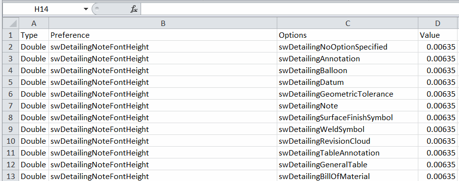

{ width=350 }

该宏导出所有文档属性（位于工具->选项->文档菜单下）

该宏利用[反射](https://docs.microsoft.com/zh-cn/dotnet/csharp/programming-guide/concepts/reflection)动态读取所有可用的用户首选项枚举，并调用相应的SOLIDWORKS API提取每个属性值。

宏将属性输出到CSV文件中，可以在Excel中打开。包括以下信息：

* 首选项组 - 数字、开关或文本
* 首选项的ID - 正在导出的确切选项
* 首选项选项 - 关于首选项的附加信息
* 值 - 首选项的当前值

请参考[System Options and Document Properties](https://help.solidworks.com/2016/english/api/sldworksapiprogguide/overview/system_options_and_document_properties.htm)文章，了解与特定首选项ID和值匹配的选项列表。

{ width=350 }

如果需要比较不同文件之间的首选项，该宏可能很有用。可以使用任何差异工具简化比较并识别差异，例如[WinMerge](https://winmerge.org/)

{ width=550 }

可以通过修改宏开头的*OUT_FILE_PATH*常量来自定义文件输出位置。

~~~ cs
const string OUT_FILE_PATH = @""; //输出文件将在与SOLIDWORKS模型相同的位置创建，并命名为<模型名称>_prefs.csv
const string OUT_FILE_PATH = @"Options.csv"; //输出文件将在与SOLIDWORKS模型相同的位置创建，并命名为Options.csv
const string OUT_FILE_PATH = @"D:\Output\prefs.csv"; //文件将输出到D:\Output\prefs.csv
~~~

请参考[创建和运行VSTA宏](solidworks-api/getting-started/macros/create-vsta/)了解有关创建和添加代码到VSTA宏的信息。

## C# VSTA宏

~~~ cs
using SolidWorks.Interop.sldworks;
using SolidWorks.Interop.swconst;
using System.Runtime.InteropServices;
using System;
using System.Collections.Generic;
using System.IO;

namespace ExtractAlLDocProperties.csproj
{
    public partial class SolidWorksMacro
    {
        const string OUT_FILE_PATH = @"";

        public delegate object PreferenceHandlerDelegate(IModelDocExtension ext, int pref, swUserPreferenceOption_e opt, out string type);

        public void Main()
        {
            try
            {
                IModelDoc2 model = swApp.IActiveDoc2;

                if (model != null)
                {
                    IModelDocExtension modelExt = model.Extension;

                    Dictionary<Type, PreferenceHandlerDelegate> handlers = InitHandlers();

                    string outFilePath = OUT_FILE_PATH;

                    if (string.IsNullOrEmpty(outFilePath))
                    {
                        outFilePath = Path.GetFileNameWithoutExtension(model.GetTitle()) + "_prefs.csv";
                    }

                    if (!Path.IsPathRooted(outFilePath))
                    {
                        string curModelPath = model.GetPathName();

                        if (string.IsNullOrEmpty(curModelPath))
                        {
                            throw new NullReferenceException("Current model is not saved. Either save the model or specify the full path to the output file");
                        }

                        outFilePath = Path.Combine(Path.GetDirectoryName(curModelPath), outFilePath);
                    }

                    ExtractUserPreferences(modelExt, outFilePath, handlers);
                }
                else
                {
                    throw new NullReferenceException("Please open the model");
                }
            }
            catch (Exception ex)
            {
                swApp.SendMsgToUser2(ex.Message, (int)swMessageBoxIcon_e.swMbStop, (int)swMessageBoxBtn_e.swMbOk);
            }
        }

        private void ExtractUserPreferences(IModelDocExtension modelExt, string outFilePath, Dictionary<Type, PreferenceHandlerDelegate> handlers)
        {
            using (StreamWriter fileWriter = new StreamWriter(outFilePath))
            {
                fileWriter.WriteLine("Type,Preference,Options,Value");

                foreach (KeyValuePair<Type, PreferenceHandlerDelegate> prefData in handlers)
                {
                    foreach (Enum pref in Enum.GetValues(prefData.Key))
                    {
                        if (pref.ToString().StartsWith("swDetailing"))
                        {
                            foreach (swUserPreferenceOption_e opt in Enum.GetValues(typeof(swUserPreferenceOption_e)))
                            {
                                OutputValue(fileWriter, prefData.Value, modelExt, pref, opt);
                            }
                        }
                        else
                        {
                            OutputValue(fileWriter, prefData.Value, modelExt, pref, swUserPreferenceOption_e.swDetailingNoOptionSpecified);
                        }
                    }
                }
            }
        }

        private Dictionary<Type, PreferenceHandlerDelegate> InitHandlers()
        {
            Dictionary<Type, PreferenceHandlerDelegate> preferences
                = new Dictionary<Type, PreferenceHandlerDelegate>();

            preferences.Add(typeof(swUserPreferenceDoubleValue_e),
                GetDoublePreferenceValue);

            preferences.Add(typeof(swUserPreferenceIntegerValue_e),
                GetIntegerPreferenceValue);

            preferences.Add(typeof(swUserPreferenceStringValue_e),
                GetStringPreferenceValue);

            preferences.Add(typeof(swUserPreferenceToggle_e),
                GetTogglePreferenceValue);
            return preferences;
        }

        private void OutputValue(System.IO.StreamWriter fileWriter, PreferenceHandlerDelegate handler, 
            IModelDocExtension ext, Enum pref, swUserPreferenceOption_e opt) 
        {
            int prefVal = Convert.ToInt32(pref);

            string type;
            object value = handler.Invoke(ext, prefVal, opt, out type);

            string line = string.Format("{0},{1},{2},\"{3}\"", type, pref, opt, value);

            fileWriter.WriteLine(line);
        }

        private object GetDoublePreferenceValue(IModelDocExtension ext, int pref, swUserPreferenceOption_e opt, out string type) 
        {
            type = "Double";
            return ext.GetUserPreferenceDouble(pref, (int)opt);
        }

        private object GetIntegerPreferenceValue(IModelDocExtension ext, int pref, swUserPreferenceOption_e opt, out string type)
        {
            type = "Integer";
            return ext.GetUserPreferenceInteger(pref, (int)opt);
        }

        private object GetStringPreferenceValue(IModelDocExtension ext, int pref, swUserPreferenceOption_e opt, out string type)
        {
            type = "String";
            return ext.GetUserPreferenceString(pref, (int)opt);
        }

        private object GetTogglePreferenceValue(IModelDocExtension ext, int pref, swUserPreferenceOption_e opt, out string type)
        {
            type = "Toggle";
            return ext.GetUserPreferenceToggle(pref, (int)opt);
        }

        public SldWorks swApp;
    }
}
~~~

