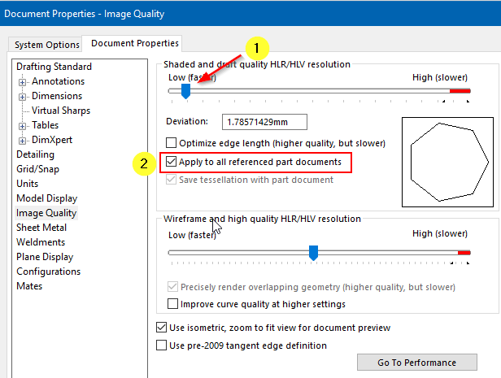

作者：[Eddy Alleman](https://www.linkedin.com/in/eddyalleman/) ([EDAL Solutions](www.edalsolutions.be))

{ width=650 }

在处理大型装配体时，您可以设置文档选项，以便将文件保存得尽可能轻量：

## 阴影和草图质量HLR/HLV分辨率
控制用于阴影渲染输出的曲面细分。较高的分辨率设置会导致模型重建速度变慢，但曲线更准确。
低（较快）- 高（较慢）

这意味着，如果您在装配体中工作，可以手动将所有引用的文件设置为低图像质量。

但是，如果您有很多文件并且需要在大型装配体中工作，可以使用宏在打开根装配体之前帮助使文件变得更轻。

此宏设置了上述图像中显示的两个选项（1）和（2）。零件无法使用选项（2）。

如果您将此宏与Batch+一起使用，其真正的威力就会显现出来。您可以在不处理装配体时运行它。

{ width=800 }

~~~ vb
Option Explicit

' An assembly or a part file must be the active document.

' the document options are set to use coarse quality
' and the checkmark "Apply to all referenced part documents" is set to ON if the active document is an assembly

Dim swxApp As SldWorks.SldWorks
Dim swModel As SldWorks.ModelDoc2

Sub main()

try_:

    On Error GoTo catch_

    Set swxApp = Application.SldWorks
    
    Set swModel = swxApp.ActiveDoc

    'Check if active document is a Part or an Assembly file
    Select Case True
    
           Case swModel Is Nothing, (swModel.GetType <> swDocASSEMBLY And swModel.GetType <> swDocPART)
              Call swxApp.SendMsgToUser2("Please open an assembly or part file", swMbInformation, swMbOk)
                           
           Case Else
               Call SetCoarseQuality
               
    End Select

    GoTo finally_:
    
catch_:

        Debug.Print "Error: " & Err.Number & ":" & Err.Source & ":" & Err.Description
    
finally_:
    
End Sub

Private Function SetCoarseQuality() As Boolean
                  
    'set to use coarse quality
    Dim boolstatus As Boolean
    boolstatus = swModel.Extension.SetUserPreferenceInteger(swUserPreferenceIntegerValue_e.swImageQualityShaded, _
                                                              swUserPreferenceOption_e.swDetailingNoOptionSpecified, _
                                                              swImageQualityShaded_e.swShadedImageQualityCoarse)
        
    'option "Apply to all referenced part documents" is set to ON
    If swModel.GetType = swDocASSEMBLY Then
      
       Dim res As Boolean
       res = swModel.Extension.SetUserPreferenceToggle(swImageQualityApplyToAllReferencedPartDoc, _
                                                         swDetailingNoOptionSpecified, True)
        
    End If
           
End Function
~~~

