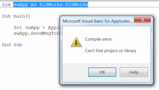
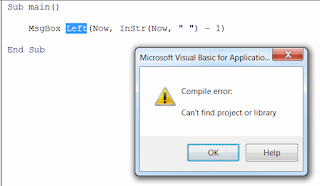
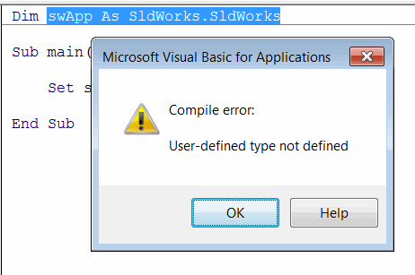
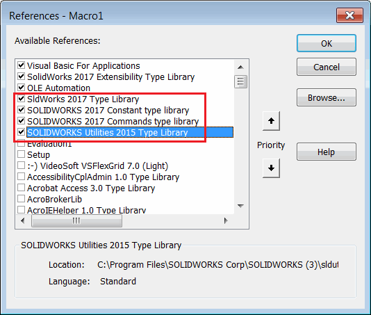
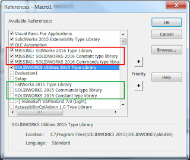

## 症状

* 从互联网下载的旧版SOLIDWORKS宏或公司内部开发的宏无法运行。
*显示“找不到项目或库错误”，并且SOLIDWORKS的声明都被突出显示。

{ width=320 height=182 }

或者非SOLIDWORKS的声明也可能被突出显示（例如Left或Mid函数）

{ width=320 height=185 }

* 如果宏中从未选择过这些库，则可能显示“编译错误：未定义的类型”。

{ width=200 }

## 原因

* 宏指向旧版SOLIDWORKS类型库，无法自动解析它们。结果，这些库被标记为“MISSING”。

* 在宏中从未选择过SOLIDWORKS类型库，或者在宏中明确取消了选择（通常在将宏从*.swp宏转换时会发生这种情况）

## 解决方法

* 通过“工具”->“宏”->“编辑”菜单打开宏进行[编辑](https://help.solidworks.com/2017/english/solidworks/sldworks/t_edit_macro.htm)
* 在VBA编辑器中导航到“工具”->“引用”菜单
* 如下图所示选择SOLIDWORKS类型库。如果在“可用引用”列表中找不到这些库，请使用“浏览...”按钮，在SOLIDWORKS的安装文件夹中找到*sldworks.tlb*、*swconst.tlb*、*swcommands.tlb*。

{ width=200 }

* 如果已选择这些库或者存在**MISSING**关键字，则需要按照以下步骤强制更新引用：

{ width=320 height=269 }

* 取消选中所有引用SOLIDWORKS的库（包括带有**MISSING**关键字的库）
* 点击“确定”
* 再次打开相同的对话框，选中相应的SOLIDWORKS库。这些库通常在引用列表中可用。
如果找不到，可以使用“浏览...”按钮从SOLIDWORKS的安装文件夹中手动选择库。

或者，您可以将所有代码复制粘贴到新创建的宏中。