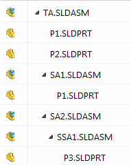

{ width=200 }

该示例演示了如何使用文档管理器API从文档中获取所有层级的组件。

* 在SOLIDWORKS中打开宏
* 指定文档管理器密钥
* 指定顶层装配的路径
* 运行宏。所有组件数据将输出到VBA编辑器的立即窗口中

要仅获取顶层组件，请修改函数如下所示

~~~ vb
Call GetAllComponents(swDmDoc, "", True, comps)
~~~

> 在遍历装配层级时，请不要存储[ISwDMComponent](https://help.solidworks.com/2015/english/api/swdocmgrapi/solidworks.interop.swdocumentmgr~solidworks.interop.swdocumentmgr.iswdmcomponent.html)的指针，因为一旦文档关闭或指针被释放，它将被销毁

~~~ vb
Type CompData
    DocName As String
    CompName As String
    ConfName As String
End Type

Const FILE_PATH As String = "Full path to assembly file"

Const LIC_KEY As String = "Document Manager License Key"

Dim swDmApp As SwDocumentMgr.SwDMApplication4

Sub main()

    Dim swClassFact As SwDocumentMgr.swDmClassFactory
    
    Set swClassFact = New SwDocumentMgr.swDmClassFactory
    
    Set swDmApp = swClassFact.GetApplication(LIC_KEY)
    
    If Not swDmApp Is Nothing Then
        
        Dim res As SwDmDocumentOpenError
        Dim swDmDoc As SwDocumentMgr.SwDMDocument
        
        Set swDmDoc = swDmApp.GetDocument(FILE_PATH, swDmDocumentAssembly, True, res)
        
        If Not swDmDoc Is Nothing Then
            
            Dim comps() As CompData
            
            Call GetAllComponents(swDmDoc, "", False, comps)
            Dim i As Integer
            
            For i = 0 To UBound(comps)
                Dim comp As CompData
                comp = comps(i)
                Debug.Print comp.CompName & " (" & comp.ConfName & ")" & " - " & comp.DocName
            Next
            
        Else
            MsgBox "Failed to open the document"
        End If
        
    End If
    
End Sub

Sub GetAllComponents(doc As SwDocumentMgr.SwDMDocument, ConfName As String, topLevelOnly As Boolean, comps() As CompData)
    
    If ConfName = "" Then
        ConfName = doc.ConfigurationManager.GetActiveConfigurationName()
    End If
    
    Dim swDmConf As SwDocumentMgr.SwDMConfiguration2
    
    Set swDmConf = doc.ConfigurationManager.GetConfigurationByName(ConfName)
    
    GetComponents swDmConf, comps, Not topLevelOnly, False
        
End Sub

Sub GetComponents(conf As SwDMConfiguration2, coll() As CompData, recursive As Boolean, isArrInit As Boolean)
    
    Dim vComps As Variant
    vComps = conf.GetComponents()
    
    If Not IsEmpty(vComps) Then
        
        Dim i As Integer
        
        For i = 0 To UBound(vComps)
            
            Dim swDmComp As SwDocumentMgr.SwDMComponent10
            Set swDmComp = vComps(i)
            
            Dim comp As CompData
            comp.DocName = Right(swDmComp.PathName, Len(swDmComp.PathName) - InStrRev(swDmComp.PathName, "\"))
            comp.CompName = swDmComp.Name2
            comp.ConfName = swDmComp.ConfigurationName
            
            If isArrInit Then
                ReDim Preserve coll(UBound(coll) + 1)
            Else
                ReDim coll(0)
                isArrInit = True
            End If
            
            coll(UBound(coll)) = comp
            
            If recursive Then
                
                Dim err As SwDmDocumentOpenError
                Dim swDmChildDoc As SwDocumentMgr.SwDMDocument10
                Dim swDmChildConf As SwDocumentMgr.SwDMConfiguration2
                
                Set swDmChildDoc = swDmComp.GetDocument2(True, Nothing, err)
                
                Set swDmChildConf = swDmChildDoc.ConfigurationManager.GetConfigurationByName(swDmComp.ConfigurationName)
                
                GetComponents swDmChildConf, coll, recursive, isArrInit
                
            End If
            
        Next
        
    End If
    
End Sub
~~~

