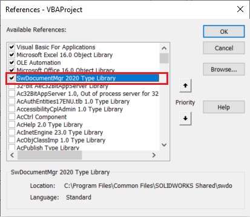
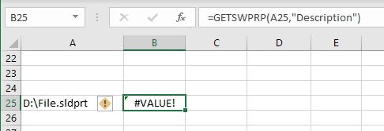

{ width=250 }

这个Excel VBA宏为Excel调色板添加了额外的功能，可以从SOLIDWORKS文件中读取和写入自定义属性。

这个宏利用了文档管理器，使得读取和写入属性的过程比常规的SOLIDWORKS API快得多（10倍到100倍以上）。

此外，使用这个宏不需要安装SOLIDWORKS。

## 准备工作

* 如果您没有文档管理器许可证密钥，请按照[激活文档管理器](/solidworks-document-manager-api/getting-started/create-connection#activating-document-manager)文章中的步骤获取文档管理器许可证。这个密钥对于订阅SOLIDWORKS的客户是免费的。
* 创建一个新的Excel文档并创建一个新的宏。将下面的宏代码粘贴到宏中。

~~~ vb
Const SW_DM_KEY As String = "<Your License Key>"

Sub main()
End Sub

Function ConnectToDm() As SwDocumentMgr.SwDMApplication

    Dim swDmClassFactory As SwDocumentMgr.swDmClassFactory
    Dim swDmApp As SwDocumentMgr.SwDMApplication
    
    Set swDmClassFactory = CreateObject("SwDocumentMgr.SwDMClassFactory")
        
    If Not swDmClassFactory Is Nothing Then
        Set swDmApp = swDmClassFactory.GetApplication(SW_DM_KEY)
        Set ConnectToDm = swDmApp
    Else
        Err.Raise vbError, "", "Document Manager SDK is not installed"
    End If
    
End Function

Function OpenDocument(swDmApp As SwDocumentMgr.SwDMApplication, path As String, readOnly As Boolean) As SwDocumentMgr.SwDMDocument10
    
    Dim ext As String
    ext = LCase(Right(path, Len(path) - InStrRev(path, ".")))
    
    Dim docType As SwDmDocumentType
    
    Select Case ext
        Case "sldlfp"
            docType = swDmDocumentPart
        Case "sldprt"
            docType = swDmDocumentPart
        Case "sldasm"
            docType = swDmDocumentAssembly
        Case "slddrw"
            docType = swDmDocumentDrawing
        Case Else
            Err.Raise vbError, "", "Unsupported file type: " & ext
    End Select
    
    Dim swDmDoc As SwDocumentMgr.SwDMDocument10
    Dim openDocErr As SwDmDocumentOpenError
    Set swDmDoc = swDmApp.GetDocument(path, docType, readOnly, openDocErr)
    
    If swDmDoc Is Nothing Then
        Err.Raise vbError, "", "Failed to open document: '" & path & "'. Error Code: " & openDocErr
    End If
    
    Set OpenDocument = swDmDoc
    
End Function

Public Function GETSWPRP(fileName As String, prpNames As Variant, Optional confName As String = "") As Variant
    
    Dim swDmApp As SwDocumentMgr.SwDMApplication
    Dim swDmDoc As SwDocumentMgr.SwDMDocument10
    
try_:
    On Error GoTo catch_
    
    Dim vNames As Variant
            
    If TypeName(prpNames) = "Range" Then
        vNames = RangeToArray(prpNames)
    Else
        vNames = Array(CStr(prpNames))
    End If
    
    Set swDmApp = ConnectToDm()
    Set swDmDoc = OpenDocument(swDmApp, fileName, True)
    
    Dim res() As String
    Dim i As Integer
    ReDim res(UBound(vNames))
    
    Dim prpType As SwDmCustomInfoType
    
    If confName = "" Then
        For i = 0 To UBound(vNames)
            res(i) = swDmDoc.GetCustomProperty(CStr(vNames(i)), prpType)
        Next
    Else
        Dim swDmConf As SwDocumentMgr.SwDMConfiguration10
        Set swDmConf = swDmDoc.ConfigurationManager.GetConfigurationByName(confName)
        If Not swDmConf Is Nothing Then
            For i = 0 To UBound(vNames)
                res(i) = swDmConf.GetCustomProperty(CStr(vNames(i)), prpType)
            Next
        Else
            Err.Raise vbError, "", "Failed to get configuration '" & confName & "' from '" & fileName & "'"
        End If
    End If
    
    GETSWPRP = res
    
    GoTo finally_
    
catch_:
    Debug.Print Err.Description
    Err.Raise Err.Number, Err.Source, Err.Description
finally_:
    If Not swDmDoc Is Nothing Then
        swDmDoc.CloseDoc
    End If

End Function

Public Function SETSWPRP(fileName As String, prpNames As Variant, prpVals As Variant, Optional confName As String = "")
    
    Dim swDmApp As SwDocumentMgr.SwDMApplication
    Dim swDmDoc As SwDocumentMgr.SwDMDocument10
    
try_:
    On Error GoTo catch_
    
    If TypeName(prpNames) <> TypeName(prpVals) Then
        Err.Raise vbError, "", "Property name and value must be of the same type, e.g. either range or cell"
    End If
    
    Dim vNames As Variant
    Dim vVals As Variant
        
    If TypeName(prpNames) = "Range" Then
        
        vNames = RangeToArray(prpNames)
        
        vVals = RangeToArray(prpVals)
        
        If UBound(vNames) <> UBound(vVals) Then
            Err.Raise vbError, "", "Number of cells in the name and value are not equal"
        End If
    Else
        vNames = Array(CStr(prpNames))
        vVals = Array(CStr(prpVals))
    End If
    
    Set swDmApp = ConnectToDm()
    Set swDmDoc = OpenDocument(swDmApp, fileName, False)
    
    Dim i As Integer
    
    If confName = "" Then
        For i = 0 To UBound(vNames)
            swDmDoc.AddCustomProperty CStr(vNames(i)), swDmCustomInfoText, CStr(vVals(i))
            swDmDoc.SetCustomProperty CStr(vNames(i)), CStr(vVals(i))
        Next
    Else
        Dim swDmConf As SwDocumentMgr.SwDMConfiguration10
        Set swDmConf = swDmDoc.ConfigurationManager.GetConfigurationByName(confName)
        
        If Not swDmConf Is Nothing Then
            For i = 0 To UBound(vNames)
                swDmConf.AddCustomProperty CStr(vNames(i)), swDmCustomInfoText, CStr(vVals(i))
                swDmConf.SetCustomProperty CStr(vNames(i)), CStr(vVals(i))
            Next
        Else
            Err.Raise vbError, "", "Failed to get configuration '" & confName & "' from '" & fileName & "'"
        End If
    End If
    
    swDmDoc.Save
    
    SETSWPRP = "OK"
    
    GoTo finally_
    
catch_:
    Debug.Print Err.Description
    Err.Raise Err.Number, Err.Source, Err.Description
finally_:
    If Not swDmDoc Is Nothing Then
        swDmDoc.CloseDoc
    End If
    
End Function

Private Function RangeToArray(vRange As Variant) As Variant
    
    If TypeName(vRange) = "Range" Then
        Dim excelRange As range
        Set excelRange = vRange
        
        Dim i As Integer
        
        Dim valsArr() As String
        ReDim valsArr(excelRange.Cells.Count - 1)
        
        i = 0
        
        For Each cell In excelRange.Cells
            valsArr(i) = cell.Value
            i = i + 1
        Next
        
        RangeToArray = valsArr
        
    Else
        Err.Raise vbError, "", "Value is not a Range"
    End If
    
End Function
~~~

* 修改宏并在第一步中获取的许可证密钥的位置输入许可证密钥。注意，根据密钥的大小，您可能会看到“编译错误：无效的过程外错误”的错误。请参考[这篇文章](/solidworks-api/troubleshooting/macros/too-long-vba-macro-line/)找到解决方案。

~~~ vb jagged-bottom
Const SW_DM_KEY As String = "<Your License Key>"
~~~

* 在宏中添加*SwDocumentMgr YEAR Type Library*引用。

## 使用方法



宏将在Excel函数范围内添加2个函数，可以像其他函数一样在Excel中使用。

作为标准函数，用户可以将参数作为对其他单元格的引用传递。

或者可以使用自由文本。

当需要写入或读取多个属性时，使用Excel范围来最大化操作的性能。

### GETSWPRP

这个函数允许从文件或给定的配置中提取指定属性的值。如果尝试读取不存在的属性，将抛出错误。

#### 参数

* 文件名 - SOLIDWORKS零件、装配体或图纸的完整路径
* 属性名称 - 要从中读取值的属性或属性范围
* （可选）配置名称 - 要从中读取值的配置的名称，如果未指定，则从常规选项卡中读取属性

### SETSWPRP

将属性写入指定的SOLIDWORKS文件中的指定配置。如果属性已存在，则更新现有属性；如果不存在，则创建新属性。

#### 参数

* 文件名 - SOLIDWORKS零件、装配体或图纸的完整路径
* 属性名称 - 要将值写入的属性或属性范围
* 属性值 - 属性的值或值范围
* （可选）配置名称 - 要将值写入的配置的名称，如果未指定，则写入到常规选项卡中的属性

## 故障排除

如果发生错误，相应的单元格将指示错误：

要了解更多关于错误的信息，请打开宏并检查即时窗口输出。

打开的错误代码的描述可以在[这里](https://help.solidworks.com/2015/English/api/swdocmgrapi/SolidWorks.Interop.swdocumentmgr~SolidWorks.Interop.swdocumentmgr.SwDmDocumentOpenError.html)找到。

> 强烈建议在使用这个宏之前在样本数据上进行测试。在使用这个宏之前，强烈建议备份数据。

## 注意事项

这个宏将提取公式（而不是解析后的值）作为具有方程式（如质量或材料）的属性。

要定义公式，请使用""来保护"符号。例如

~~~
=SETSWPRP(A2, "Mass", """SW-Mass@Part1.SLDPRT""")
~~~