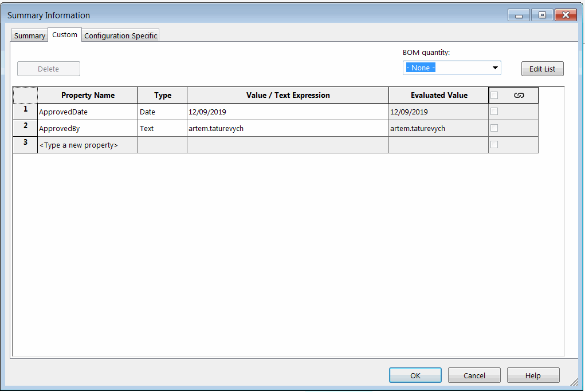

{ width=550 }

这个VBA宏演示了如何使用SOLIDWORKS文档管理器API从所有来源（通用文件属性、配置特定属性和切割清单项属性）读取所有自定义属性。

所有结果以以下格式输出到VBA编辑器的即时窗口中。

~~~
通用自定义属性
    属性：ApprovedDate
    值/文本表达式：12/09/2019
    评估值：12/09/2019
    类型：日期

配置特定属性
    B
        属性：ApprovedDate
        值/文本表达式：12/09/2019
        评估值：12/09/2019
        类型：日期

    A
        属性：ApprovedDate
        值/文本表达式：12/09/2019
        评估值：12/09/2019
        类型：日期

切割清单属性
    B
            属性：Bounding Box Length
            值/文本表达式："SW-Bounding Box Length@@@Sheet<1>@Part3.SLDPRT"
            评估值：100
            类型：文本
...

    A
            属性：Bounding Box Length
            值/文本表达式："SW-Bounding Box Length@@@Sheet<1>@CS-02.SLDPRT"
            评估值：150
            类型：文本
...
~~~

在*FILE_PATH*常量中指定文件的完整路径。

~~~ vb
Const SW_DM_KEY As String = "Your license key"

Const FILE_PATH As String = "C:\SampleModel.SLDPRT"

Dim swDmClassFactory As SwDocumentMgr.swDmClassFactory
Dim swDmApp As SwDocumentMgr.SwDMApplication

Sub main()

    Set swDmClassFactory = CreateObject("SwDocumentMgr.SwDMClassFactory")
    
    If Not swDmClassFactory Is Nothing Then
        
        Set swDmApp = swDmClassFactory.GetApplication(SW_DM_KEY)
        Dim swDmDoc As SwDocumentMgr.SwDMDocument19
        Set swDmDoc = OpenDocument(FILE_PATH, True)
        
        PrintGeneralProperties swDmDoc
        PrintConfigurationSpecificProperties swDmDoc
        PrintCutListProperties swDmDoc
        
    Else
        MsgBox "Document Manager SDK is not installed"
    End If
    
End Sub

Sub PrintGeneralProperties(dmDoc As SwDocumentMgr.SwDMDocument19)
    
    Dim vNames As Variant
    Dim vTypes As Variant
    Dim vLinkedTo As Variant
    Dim vValues As Variant
    
    dmDoc.GetAllCustomPropertyNamesAndValues vNames, vTypes, vLinkedTo, vValues
    
    Debug.Print "General Custom Properties"
    
    PrintProperties vNames, vTypes, vLinkedTo, vValues, "    "
    
End Sub

Sub PrintConfigurationSpecificProperties(dmDoc As SwDocumentMgr.SwDMDocument19)
    
    Dim vConfNames As Variant
    vConfNames = dmDoc.ConfigurationManager.GetConfigurationNames()
    
    Dim i As Integer
    
    Debug.Print "Configuration Specific Properties"
    
    For i = 0 To UBound(vConfNames)
        
        Dim confName As String
        confName = vConfNames(i)
        
        Dim swDmConf As SwDocumentMgr.SwDMConfiguration13
        Set swDmConf = dmDoc.ConfigurationManager.GetConfigurationByName(confName)
        
        Dim vNames As Variant
        Dim vTypes As Variant
        Dim vLinkedTo As Variant
        Dim vValues As Variant
        
        'NOTE: order of resolved and expressions is not correct for configurations in SW DM API, so reversing the variables
        swDmConf.GetAllCustomPropertyNamesAndValues vNames, vTypes, vValues, vLinkedTo
                
        Debug.Print "    " & confName
        
        PrintProperties vNames, vTypes, vLinkedTo, vValues, "        "
        
    Next
    
End Sub

Sub PrintCutListProperties(dmDoc As SwDocumentMgr.SwDMDocument19)

    Dim vConfNames As Variant
    vConfNames = dmDoc.ConfigurationManager.GetConfigurationNames()
    
    Dim i As Integer
    
    Debug.Print "Cut List Properties"
    
    For i = 0 To UBound(vConfNames)
        
        Dim confName As String
        confName = vConfNames(i)
        
        Dim swDmConf As SwDocumentMgr.SwDMConfiguration16
        Set swDmConf = dmDoc.ConfigurationManager.GetConfigurationByName(confName)
        
        Dim vCutListItems As Variant
        vCutListItems = swDmConf.GetCutListItems
        
        Debug.Print "    " & confName
        
        If Not IsEmpty(vCutListItems) Then
            
            Dim j As Integer
            
            For j = 0 To UBound(vCutListItems)
                
                Dim swDmCutList As SwDocumentMgr.SwDMCutListItem3
                Set swDmCutList = vCutListItems(j)
                
                Dim vNames As Variant
                Dim prpTypes() As SwDmCustomInfoType
                Dim prpLinkedTo() As String
                Dim prpValues() As String
                    
                vNames = swDmCutList.GetCustomPropertyNames()
                
                If Not IsEmpty(vNames) Then
                    
                    ReDim prpTypes(UBound(vNames))
                    ReDim prpLinkedTo(UBound(vNames))
                    ReDim prpValues(UBound(vNames))
                    
                    Dim k As Integer
                    
                    For k = 0 To UBound(vNames)
                        prpValues(k) = swDmCutList.GetCustomPropertyValue2(CStr(vNames(k)), prpTypes(k), prpLinkedTo(k))
                    Next
                    
                    PrintProperties vNames, prpTypes, prpLinkedTo, prpValues, "            "
                    
                End If
                
            Next
        
        Else
            Debug.Print "        -No Cut Lists-"
        End If
        
    Next

End Sub

Sub PrintProperties(vPrpNames As Variant, vTypes As Variant, vLinkedTo As Variant, vValues As Variant, indent As String)
    
    Dim i As Integer
    
    If Not IsEmpty(vPrpNames) Then
    
        For i = 0 To UBound(vPrpNames)
            
            Dim prpName As String
            prpName = vPrpNames(i)
            
            Dim prpVal As String
            Dim prpResVal As String
            
            prpResVal = vValues(i)
            prpVal = vLinkedTo(i)
            
            If prpVal = "" Then
                prpVal = prpResVal
            End If
            
            Dim prpType As String
            
            Select Case vTypes(i)
                Case SwDmCustomInfoType.swDmCustomInfoDate
                    prpType = "Date"
                Case SwDmCustomInfoType.swDmCustomInfoNumber
                    prpType = "Number"
                Case SwDmCustomInfoType.swDmCustomInfoText
                    prpType = "Text"
                Case SwDmCustomInfoType.swDmCustomInfoYesOrNo
                    prpType = "YesNo"
                Case SwDmCustomInfoType.swDmCustomInfoUnknown
                    prpType = "Unknown"
            End Select
            
            Debug.Print indent & "Property: " & prpName
            Debug.Print indent & "Value/Text Expression: " & prpVal
            Debug.Print indent & "Evaluated Value: " & prpResVal
            Debug.Print indent & "Type: " & prpType
            Debug.Print ""
        Next
    Else
        Debug.Print indent & "-No Properties-"
    End If
    
End Sub

Function OpenDocument(filePath As String, readOnly As Boolean) As SwDocumentMgr.SwDMDocument19
    
    Dim openErr As SwDmDocumentOpenError
    
    Dim docType As SwDocumentMgr.SwDmDocumentType
    
    Dim ext As String
    ext = LCase(Right(filePath, Len(".SLDXXX")))
    
    Select Case ext
        Case ".sldprt"
            docType = swDmDocumentPart
        Case ".sldasm"
            docType = swDmDocumentAssembly
        Case ".slddrw"
            docType = swDmDocumentDrawing
    End Select
    
    Dim swDmDoc As SwDocumentMgr.SwDMDocument19
    
    Set swDmDoc = swDmApp.GetDocument(filePath, docType, readOnly, openErr)
    
    If swDmDoc Is Nothing Then
        err.Raise vbError, "", "Failed to open document: " & openErr
    End If
    
    Set OpenDocument = swDmDoc
    
End Function
~~~

