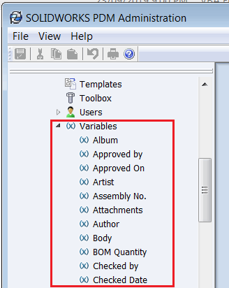

这个 VBA 宏使用 SOLIDWORKS PDM API 列出了指定保险库中的所有变量。变量名称和 ID 以以下格式输出到 VBA 编辑器的即时窗口中：

~~~
Album(102)
Approved by(53)
Approved On(46)
Artist(101)
Assembly No.(67)
Attachments(92)
Author(55)
Body(91)
BOM Quantity(106)
Checked by(58)
Checked Date(62)
~~~

~~~ vb
Sub main()

    Dim swPdmVault As New EdmVault5
    swPdmVault.LoginAuto "TestVault", 0
    
    If swPdmVault.IsLoggedIn Then
        
        Dim swPdmVarsMgr As IEdmVariableMgr7
        Set swPdmVarsMgr = swPdmVault
        
        Dim swVarPost As IEdmPos5
        Set swVarPost = swPdmVarsMgr.GetFirstVariablePosition()
        
        While Not swVarPost.IsNull
            Dim swPdmVar As IEdmVariable5
            Set swPdmVar = swPdmVarsMgr.GetNextVariable(swVarPost)
            Debug.Print swPdmVar.Name & "(" & swPdmVar.ID & ")"
        Wend
    Else
        Err.Raise vberr, "", "Not logged in"
    End If

End Sub
~~~

