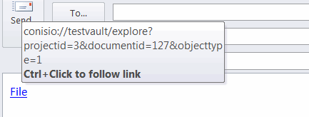

这个PowerShell脚本允许提取保险柜中指定文件的conisio url。这个链接可以用于获取一个持久的文件链接，可以被任何SOLIDWORKS PDM用户使用。

使用SOLIDWORKS PDM API提取所需数据以形成conisio url：文件ID、文件夹ID等。

创建2个脚本文件并粘贴以下代码：

## get-url.ps1
~~~ ps1
$vault_name=$args[0]
$filePath=$args[1]
$action=$args[2]

$Source = @"
Imports System
Imports System.IO

Public Class SwPdmTools

    'open view explore get lock properties history
    Public Shared Sub GetHyperlink(vaultName As String, filePath As String, action As String)

        Dim vault As Object = Activator.CreateInstance(Type.GetTypeFromProgID("ConisioLib.EdmVault"))

        vault.LoginAuto(vaultName, 0)

        Dim folderPath As String = Path.GetDirectoryName(filePath)
        Dim fileName As String = Path.GetFileName(filePath)

        Dim folder As Object = vault.GetFolderFromPath(folderPath)
        Dim file As Object = folder.GetFile(fileName)

        If Not file Is Nothing Then

            Const EdmObject_File As Integer = 1
            Dim url As String = String.Format("conisio://{0}/{1}?projectid={2}&documentid={3}&objecttype={4}", vaultName, action, folder.ID, file.ID, EdmObject_File)
            Console.WriteLine(url)

        End If

    End Sub

End Class
"@

Add-Type -TypeDefinition $Source -Language VisualBasic

[SwPdmTools]::GetHyperlink($vault_name, $filePath, $action)

~~~

## get-url.cmd
~~~ cmd
SET vaultName=%1
SET filePath=%2
SET action=%3

PowerShell -NoProfile -ExecutionPolicy Bypass -File "%~dp0get-url.ps1" %vaultName% %filePath% %action%
~~~

使用以下参数调用命令行：

* 保险柜名称
* 文件的完整路径
* 超链接的操作。选择以下之一：
    * 打开
    * 查看
    * 浏览
    * 获取
    * 锁定
    * 属性
    * 历史记录

例如：

~~~ cmd
get-url myvault "D:\myvault\part.sldprt" 浏览
~~~

超链接将输出到控制台：

{ width=450 }

现在可以使用这个超链接来访问文件。

{ width=450 }