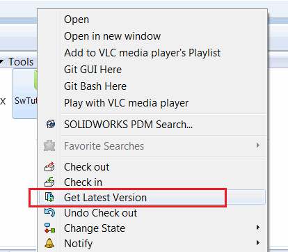

本示例演示了如何获取文件及其所有依赖项的本地副本，以供桌面应用程序使用。此宏相当于以下命令：

{ width=350 }

PDM是一种基于服务器的应用程序，当通过Windows文件资源管理器在PDM中访问文件时，文件会被缓存在本地。文件缓存可能会被清除或过时。这意味着如果文件在PDM保险库中没有被本地缓存，桌面应用程序在尝试访问该文件时可能会失败。将会出现文件未找到的错误（例如，使用SOLIDWORKS API打开文件或使用文件系统对象遍历文件夹结构或读取任何属性）。

为了提高性能，此宏利用了[SOLIDWORKS PDM API接口](https://help.solidworks.com/2018/english/api/epdmapi/epdm.interop.epdm~epdm.interop.epdm.iedmbatchget.html)中的[IEdmBatchGet](https://help.solidworks.com/2018/english/api/epdmapi/epdm.interop.epdm~epdm.interop.epdm.iedmbatchget.html)接口，该接口可以批量处理文件。

要测试此场景：

* 获取保险库中任何SOLIDWORKS文件的路径
* 清除保险库的缓存：

{ width=450 }

* 在以下宏的*main*过程中注释掉*GetLocalCopyFromVault*调用
* 运行宏。注意到*swModel*的指针为空，文件打开调用失败
* 取消注释*GetLocalCopyFromVault*并再次运行宏。现在模型成功打开，因为文件已在本地缓存中。

~~~ vb
Const FILE_PATH As String = "FULL PATH TO FILE"

Dim swApp As SldWorks.SldWorks

Sub main()

    Set swApp = Application.SldWorks
    
    GetLocalCopyFromVault FILE_PATH, "VAULT NAME", "USER NAME", "PASSWORD"
    
    Dim swOpenDocSpec As SldWorks.DocumentSpecification
    Set swOpenDocSpec = swApp.GetOpenDocSpec(FILE_PATH)
    
    Dim swModel As SldWorks.ModelDoc2
    Set swModel = swApp.OpenDoc7(swOpenDocSpec)

End Sub

Sub GetLocalCopyFromVault(path As String, vaultName As String, userName As String, password As String)
    
    Dim pdmVault As New EdmLib.EdmVault5
    pdmVault.Login userName, password, vaultName
    
    If pdmVault.IsLoggedIn Then
        GetLocalCopies pdmVault, Array(path)
    Else
        MsgBox "Failed to login to vault"
    End If
    
End Sub

Sub GetLocalCopies(vault As EdmLib.EdmVault5, vFilePaths As Variant)
    
    If Not IsEmpty(vFilePaths) Then
        
        Dim pdmBatchGetUtil As EdmLib.IEdmBatchGet
        Set pdmBatchGetUtil = vault.CreateUtility(EdmUtil_BatchGet)
        
        Dim i As Integer
        
        Dim pdmSelItems() As EdmLib.EdmSelItem
        ReDim pdmSelItems(UBound(vFilePaths))
        
        For i = 0 To UBound(vFilePaths)
            
            Dim filePath As String
            filePath = vFilePaths(i)
            
            Dim pdmFile As EdmLib.IEdmFile5
            Dim pdmFolder As EdmLib.IEdmFolder5
            
            Set pdmFile = vault.GetFileFromPath(filePath, pdmFolder)
            
            pdmSelItems(i).mlDocID = pdmFile.ID
            pdmSelItems(i).mlProjID = pdmFolder.ID
            
        Next
        
        pdmBatchGetUtil.AddSelection vault, pdmSelItems
        pdmBatchGetUtil.CreateTree 0, EdmLib.EdmGetCmdFlags.Egcf_RefreshFileListing
        pdmBatchGetUtil.GetFiles 0
        
    End If
    
End Sub
~~~

