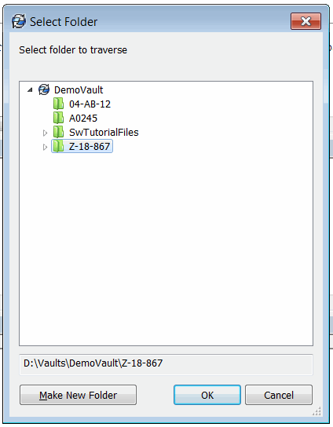

这个VBA示例演示了如何使用SOLIDWORKS PDM API在SOLIDWORKS PDM vault中递归遍历文件和文件夹。

宏显示了内置的文件夹浏览对话框，用于选择要遍历的文件夹：

{ width=250 }

宏递归遍历文件和子文件夹，并将文件或文件夹的名称、ID和级别输出到VBA编辑器的即时窗口。

{ width=350 }

即使树没有被[本地缓存](/solidworks-pdm-api/files/local-cache/)，这个宏也可以遍历树。 

~~~ vb
Const VAULT_NAME As String = "MyVault"

Dim pdmVault As EdmVault5

Sub main()

    Set pdmVault = New EdmVault5
    pdmVault.LoginAuto VAULT_NAME, 0
    
    If pdmVault.IsLoggedIn Then
        
        Dim pdmFolder As IEdmFolder5
        
        Set pdmFolder = pdmVault.BrowseForFolder(0, "Select folder to traverse")
        
        If Not pdmFolder Is Nothing Then
            TraverseFolder pdmFolder
        End If
        
    Else
        Err.Raise vbError, "User is not logged in to the vault"
    End If
    
End Sub

Sub TraverseFolder(folder As IEdmFolder5, Optional parentLevel As String = "")

    Debug.Print parentLevel & "[+]" & folder.Name & " (" & folder.ID & ")"
    
    Dim thisLevel As String
    thisLevel = parentLevel & " "
    
    Dim pdmFilePos As IEdmPos5
    Set pdmFilePos = folder.GetFirstFilePosition()

    While Not pdmFilePos.IsNull
        Dim pdmFile As IEdmFile5
        Set pdmFile = folder.GetNextFile(pdmFilePos)
        Debug.Print thisLevel & " " & pdmFile.Name & " (" & pdmFile.ID & ")"
    Wend
    
    Dim pdmSubFolderPos As IEdmPos5
    Set pdmSubFolderPos = folder.GetFirstSubFolderPosition()
    
    While Not pdmSubFolderPos.IsNull
        Dim pdmSubFolder As IEdmFolder5
        Set pdmSubFolder = folder.GetNextSubFolder(pdmSubFolderPos)
        TraverseFolder pdmSubFolder, thisLevel
    Wend

End Sub
~~~

