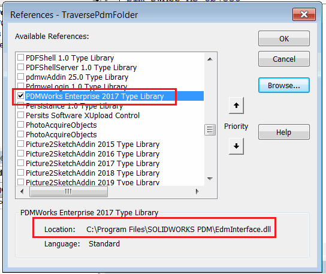

在某些情况下，直接从SOLIDWORKS VBA或VSTA宏中使用SOLIDWORKS PDM API可能会有益处。在这种情况下，您可以将[SOLIDWORKS API](/solidworks-api/)和[SOLIDWORKS PDM API](/solidworks-pdm-api/)函数结合在一个宏中。

## 在VBA宏中连接到SOLIDWORKS PDM

宏应该像为SOLIDWORKS创建任何其他VBA宏一样创建。如果需要，您还可以将PDM API代码添加到现有的SOLIDWORKS宏中。

### 提前绑定

为了启用对SOLIDWORKS PDM API的提前绑定（推荐的方法），需要在VBA编辑器的工具->引用窗口中添加SOLIDWORKS类型库。

搜索*PDMWorks Enterprise [年份] 类型库*。如果此引用在列表中不可用，请使用*浏览*按钮在安装目录中查找文件，如下图所示：

{ width=450 }

下面是一个连接到vault的典型初始化例程。如果需要登录，则此示例将显示标准的PDM登录窗口。

~~~ vb
Dim pdmVault As EdmVault5

Sub main()

    Set pdmVault = New EdmVault5
    pdmVault.LoginAuto "MyVault", 0
    
    If pdmVault.IsLoggedIn Then
        'TODO: 实现例程            
    Else
        Err.Raise vbError, "用户未登录到vault"
    End If
    
End Sub
~~~

或者，也可以通过提供登录名和密码进行静默登录。

~~~ vb
pdmVault.Login "admin", "mypassword", "MyVault"
~~~

### 晚期绑定

与SOLIDWORKS宏不同，SOLIDWORKS PDM库不是引用列表中的默认选择。当您创建新的宏时，此库未被选中，可能无法从库列表中选择。当需要在不同的机器上共享宏时，这可能会带来额外的挑战。

在这种情况下，利用[晚期绑定](/visual-basic/variables/declaration/#early-binding-and-late-binding)连接到vault并调用PDM API可能会有益处。在这种情况下，不需要在VBA编辑器中添加对宏的引用。所有的PDM对象必须声明为[Object](/visual-basic/variables/standard-types#object)。函数仍然可以以相同的方式调用，但是智能感知将不可用。

~~~ vb
Dim pdmVault As Object

Sub main()

    Set pdmVault = CreateObject("ConisioLib.EdmVault")

    pdmVault.LoginAuto "MyVault", 0
    
    If pdmVault.IsLoggedIn Then
        'TODO: 实现例程            
    Else
        Err.Raise vbError, "用户未登录到vault"
    End If
    
End Sub
~~~