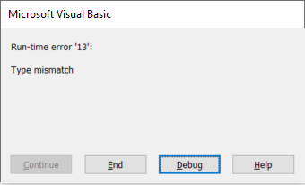

条件是任何应用程序的重要部分，因为它通常驱动应用程序的逻辑。

在 Visual Basic 中，有多种选项可以根据条件执行特定的代码。

## If 语句

这是决定是否执行 **If** 语句体内代码的最常见方式。If 语句简单地将表达式评估为布尔值 **True** 或 **False**，并在表达式为 **True** 时执行代码。这意味着所有表达式必须结果为 **True** 或 **False**。

~~~ vb jagged
If True Then
    Debug.Print "始终打印"
End If
~~~

然而，以下代码将导致运行时异常，因为字符串值无法转换为布尔值。

~~~ vb jagged
If "A" Then
End If
~~~

而以下代码片段是有效的，因为比较两个字符串值会得到布尔值。

~~~ vb jagged
If "A" = "A" Then
End If
~~~

### 回退值

可以为语句指定回退值，即在主条件为 **False** 时应执行的代码块。



### 多个条件

可以指定多个条件，并使用[逻辑运算符](#logical-operators)组合表达式。



条件会逐个执行，直到找到 **True** 条件为止。

## Select Case

如果需要对多个常量值进行检查，而不是使用 **If-ElseIf**，可以使用 **Select Case**。虽然 **Select Case** 可以被认为是对 **If-ElseIf** 的冗余，但它被广泛使用，因为它可以创建简单、更易读的代码。**Select Case** 语句还支持使用 **Case Else** 语句指定回退值。

下面的代码将一周中的某一天的位置转换为其文本表示。如果指定的值超出 1-7 范围，它会抛出错误，因为这将是无效的输入。



## 逻辑运算符

Visual Basic 支持 3 个逻辑运算符：**And**、**Or** 和 **Not**。

* **And** 运算符的结果将在其所有参数都等于 **True** 时等于 **True**。
* **Or** 运算符的结果将在其至少有一个参数等于 **True** 时等于 **True**。
* **Not** 运算符将值反转。

运算符可以使用括号分组，以定义操作的顺序。



以下表格演示了基于值和运算符的结果。

| Value1 | Value2 | Operator | Result |
|--------|--------|----------|--------|
| True   | True   | And      | True   |
| True   | False  | And      | False  |
| False  | True   | And      | False  |
| False  | False  | And      | False  |
| True   | True   | Or       | True   |
| True   | False  | Or       | True   |
| False  | True   | Or       | True   |
| False  | False  | Or       | False  |
| True   | N/A    | Not      | False  |
| False  | N/A    | Not      | True   |