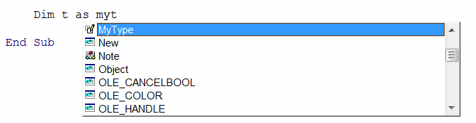

{ width=350 }

在 Visual Basic 中，可以使用 **Type - End Type** 代码块定义复杂的数据结构（组）变量。

~~~ vb
Type MyType
    Var1 As Double
    Var2 As String
End Type
~~~

这使开发人员能够创建易于理解和使用的数据结构。

可以在类型代码块中定义任何类型的变量。

在类型中声明的属性是公共的，并且可以在智能感知中浏览：

{ width=250 }

无法在类型中设置访问修饰符或添加任何函数或过程：

{ width=350 }

~~~ vb
Type MyType
    IntValue As Integer
    DoubleValue As Double
    StringValue As String
End Type

Sub main()

    Dim val1 As MyType
    val1.DoubleValue = 10.5
    val1.IntValue = 5
    val1.StringValue = "Hello World"
    
    Dim val2 As MyType
    val2 = val1 'all values are copied
    
    val2.DoubleValue = 2.5
    val2.StringValue = "Modified Hello World"
    val2.IntValue = 1
    
    '10.5, 5, Hello World
    Debug.Print val1.DoubleValue & ", " & val1.IntValue & ", " & val1.StringValue
    
    '2.5, 1, Modified Hello World
    Debug.Print val2.DoubleValue & ", " & val2.IntValue & ", " & val2.StringValue
    
End Sub
~~~

