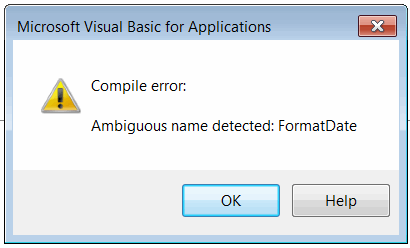

函数用于定义可从其他函数调用的可重用过程（一组代码语句）。Visual Basic中的函数是同步的，这意味着调用者必须等待函数返回控制权，然后才能继续执行下一条语句。

函数可以返回值，也可以是无返回值（这种函数称为**子程序**或**子**）。

函数可以期望或返回参数（**ByRef**参数），也可以没有参数。

调用自身的函数称为**递归函数**。

## 声明函数

函数在**Function**-**End Function**块内声明。

~~~ vb
Function <名称>(<可选参数>) As <类型>
<代码语句>
End Function
~~~

函数的类型应在**As**关键字之后定义。如果未明确指定类型，则默认为[Variant](visual-basic/variables/standard-types#variant)类型。

子程序在**Sub**-**End Sub**块内声明。

~~~ vb
Sub <名称>(<可选参数>)
<代码语句>
End Sub
~~~

函数和过程在模块或类中必须具有唯一的名称。在Visual Basic中，函数不能重载。即使函数具有不同的参数，它们也不能具有相同的名称，否则会引发“检测到模棱两可的名称”编译错误。

{ width=300 }

## 调用函数和子程序

通过指定函数名来调用函数和子程序。如果函数位于不同的模块中，则函数名前面应加上模块名和.符号。

~~~ vb
Func1
Module1.Func1
~~~

如果函数的结果被赋给变量，则应使用括号符号()。如果使用*Call*运算符调用函数，则也应使用括号符号()。

~~~ vb
val = Func1() '使用()来获取值
Call Func1()  '使用()调用函数时使用Call运算符
~~~

> **规则：**没有等号（或call运算符）-没有括号。

## 返回值

要从函数返回值，需要将其名称视为变量，并遵循与[赋值变量值](visual-basic/variables/)相同的规则。

~~~ vb
Function GetDouble() As Double
    GetDouble = 10
End Sub

Function GetObject() As Object
    Set GetObject = <对象引用>
End Sub
~~~

## 传递参数

参数必须按照函数中声明的顺序传递给函数或子程序。

参数可以作为变量传递，也可以在调用函数时“即兴”定义。

~~~ vb
Func par1, par2, "value2" '调用带有3个参数的函数Func
~~~

当调用函数而没有传递所需的参数时，会引发“参数不可选”编译错误。

{ width=300 }

### 引用参数

函数或子程序可以返回额外的参数。需要使用**ByRef**关键字将参数声明为输出参数。

~~~ vb
Function Func(par1 As Double, ByRef outPar1 As Integer) As Double '函数期望输入par1，并返回双精度值和另一个整数值作为引用参数
End Function
~~~

### 可选参数

函数或子程序可以声明具有默认值的可选参数。在这种情况下，在调用函数时不需要显式设置参数的值。

~~~ vb
Call Proc() '不需要显式指定参数的值。在这种情况下，使用默认值（即0.5）

Sub Proc(Optional par1 As Double = 0.5) '具有默认值0.5的可选参数
End Sub
~~~

可选参数可以通过名称（*参数名称*:=*参数值*）进行选择性设置。这允许按照与函数签名中声明的顺序不同的顺序设置参数。

~~~ vb
Call Func(param1:=1, param3:="Test") '只使用2个参数（第1个和第3个）

Function Func (Optional param1 As Integer = 0, Optional param2 As Double = 0.0, Optional param3 As String = "")
End Function
~~~

下面的示例演示了可以使用可选参数的情况。

~~~ vb
Sub main()
    
    Debug.Print Pow(2) '4
    Debug.Print Pow(2, 3) '8

    PrintAddress state:="NSW", postcode:=2000 'Australia NSW 2000
    
End Sub

Function Pow(number As Double, Optional power As Double = 2) As Double
    
    Pow = number ^ power
    
End Function

Sub PrintAddress(Optional country As String = "Australia", Optional state As String = "", Optional suburb As String = "", Optional postcode As Integer = 0, Optional streetName As String = "", Optional buildingNumber As Integer = 0, Optional unitNumber As Integer = 0)

    If country <> "" Then
        Debug.Print country
    End If
    
    If state <> "" Then
        Debug.Print state
    End If
    
    If suburb <> "" Then
        Debug.Print suburb
    End If
    
    If postcode > 0 Then
        Debug.Print postcode
    End If
    
    If streetName <> "" Then
        Debug.Print streetName
    End If
    
    If buildingNumber > 0 Then
        Debug.Print buildingNumber
    End If
    
    If unitNumber > 0 Then
        Debug.Print "Unit: " & unitNumber
    End If
    
End Sub
~~~

## 终止函数和子程序

函数和子程序可以在任何阶段终止，并将控制权返回给调用者，使用**Exit Function**和**Exit Sub**。

下面的示例演示了使用函数和子程序的不同情况。

~~~ vb
Sub main()
    
    'prints ProcedureWithoutParameters twice
    ProcedureWithoutParameters
    ProcedureWithoutParameters
    
    'Compile error: Argument not optional
    'SayHello
    
    'Hello, Test
    SayHello "Test"
    
    Dim formDate As String
    FormatDate "dd-MM-yyyy", formDate
    
    '20-06-2018
    Debug.Print formDate
    
    '20-06-2018
    Debug.Print GetFormattedDate("dd-MM-yyyy")
    
End Sub

Sub ProcedureWithoutParameters()
    
    Debug.Print "ProcedureWithoutParameters"

End Sub

Sub SayHello(name As String)
    
    Debug.Print "Hello, " & name

End Sub

Sub FormatDate(dateFormat As String, ByRef formattedDate As String)
    
    Dim curDate As Date
    curDate = Now
    
    formattedDate = format(curDate, dateFormat)
    
End Sub

Function GetFormattedDate(dateFormat As String) As String
    
    Dim curDate As Date
    curDate = Now
    
    GetFormattedDate = format(curDate, dateFormat)
    
End Function
~~~

