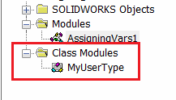
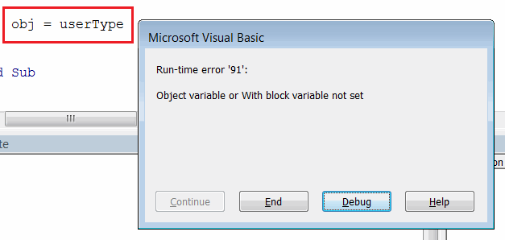

## 声明变量

在Visual Basic中，变量可以显式或隐式声明。要显式声明变量，需要使用*Dim*关键字或*Public*关键字将变量声明为公共类或模块成员（有关更多信息，请参阅[变量作用域](/visual-basic/variables/scope)文章）。

可以使用*As*关键字声明变量的类型。

~~~ vb
Dim textVal As String
~~~

> 如果未明确声明变量的类型，则默认为[Variant](/visual-basic/variables/standard-types#variant)

~~~ vb
Dim varVal '隐式声明为Variant
~~~

在隐式声明变量时不使用*Dim*关键字。在这种情况下，变量的值直接赋值。

~~~ vb
implicitVal = 10 '隐式声明和赋值变量
~~~

这种方法不推荐使用，因为它可能会引入代码的歧义和潜在问题。

> 为了在Visual Basic中强制使用显式变量声明，需要使用*Option Explicit*语句。在这种情况下，如果发现隐式变量，则会出现编译错误。

{ width=300 }

### 声明相同类型的一组变量

可以将变量声明为一组。

~~~ vb
Dim textVar1, textVar2, textVar3 As String '3个显式声明为String的变量
~~~

这种方法可以使代码更易读和紧凑。

### 声明不同类型的一组变量

可以使用每个变量的声明字符来显式声明类型，使用短声明。

~~~ vb
Dim intVar%, doubleVar#, longVar& '使用短声明显式声明整数、双精度和长整型变量
~~~

请参阅[标准类型](/visual-basic/variables/standard-types)文章，了解声明字符的列表。

> 这是一种传统的变量声明方式。不推荐使用这种方法来声明变量。

## 赋值

为了给变量赋值，需要使用等号（=）符号，变量名出现在左边，变量值出现在右边。

~~~ vb
Dim varName As String
varName = "VarValue"
~~~

可以将一个变量的值复制给另一个变量

~~~ vb
Dim var1 As Integer
Dim var2 As Integer
var1 = 10
var2 = var1 'var2的值现在等于var1的值，即10
~~~

可以将函数调用的结果赋值给变量。有关函数的更多信息，请参阅[函数和过程](/visual-basic/functions)文章。

~~~ vb
Dim funcRes As Double
funcRes = GetValueFunc()
~~~

## 声明常量

常量允许定义在执行过程中不会改变的值。通常用于声明数学常量（例如PI、重力常数等）、转换因子（例如小时到分钟、英寸到米等）或任何其他程序特定的值。

使用*Const*语句声明常量，并在声明时赋值。

~~~ vb
Const G As Double = 9.8 '重力常数
~~~

与变量声明相同，常量类型可以显式定义（使用*As*关键字）或隐式定义。

一旦声明，常量的值就不能更改。否则将出现编译错误。

{ width=300 }

此代码示例演示了声明和赋值常量和变量的不同方式。

~~~ vb
Sub main()

    Dim i, j, k As Integer 'declaring 3 variables of type Integer

    i = 10 'setting the value to declared variable
    l = 20 'setting the value of implicitly declared variable
    Debug.Print TypeName(l) 'Integer
    
    Dim intVar%, doubleVar#, longVar&
    Debug.Print TypeName(intVar%) 'Integer
    Debug.Print TypeName(doubleVar#) 'Double
    Debug.Print TypeName(longVar&) 'Long
    
    Const PI As Double = 3.14159265359 'declaring and initiating constant
    'PI = 0 'compile error
    
    Dim res As Double
    res = Sqrt(16) 'returns 4 and assigns to res variable
    Debug.Print res
    
End Sub
~~~

## 赋值引用变量

与值类型不同，[引用类型](/visual-basic/variables/user-defined-types#class)在赋值时必须遵循一些额外的规则。

{ width=200 }

* 必须使用*new*关键字创建引用类型的新实例。否则将显示运行时错误'91'

{ width=350 }

* 必须使用*Set*关键字来赋值，否则将显示运行时错误'91'

{ width=350 }

请参阅下面的代码以正确赋值引用类型变量。

~~~ vb
Sub main()

    Dim userType As MyUserType
    Set userType = New MyUserType
    Dim obj As Object
    
    'obj = userType 'Object variable or with block variable not set when Set keyword is not used
    Set obj = userType 'assigning the pointer to the MyUserType object to obj variable

End Sub
~~~

> 引用变量只保存指向实际值的指针，即Set关键字将引用（而不是实际值，如值类型中所示）赋给变量。这意味着如果将一个变量的引用赋给另一个变量，它们都将引用相同的数据。

### 绑定

绑定是将对象分配给变量的过程。当使用早期绑定时，特定的对象类型在预先声明，因此绑定可以在编译时发生。晚期绑定在运行时解析，事先不知道具体的对象类型。

#### 早期绑定

~~~ vb
Dim objLate As Object '晚期绑定的示例
Dim objEarly as MySpecificType '早期绑定的示例
~~~

早期绑定的对象通常使用*new*关键字初始化

~~~ vb
Dim objEarly as MySpecificType
Set objEarly = new MySpecificType
~~~

##### 优点

* 性能。编译器可以根据对象的类型和大小在编译时执行所需的优化。
* 可维护性。当声明特定类型时，代码更清晰、更易于维护和阅读。
* 早期绑定对象可用于动态帮助和智能感知（代码完成）功能。

#### 晚期绑定

晚期绑定的对象通常使用[CreateObject](https://msdn.microsoft.com/zh-cn/vba/language-reference-vba/articles/createobject-function)或[GetObject](https://msdn.microsoft.com/zh-cn/vba/language-reference-vba/articles/getobject-function)函数初始化

~~~ vb
Dim xlApp As Object
Set xlApp = CreateObject("Excel.Application")
~~~

但是，在晚期绑定中仍然可以使用*new*关键字，而在早期绑定中使用CreateObject或GetObject。

##### 优点

* 无需维护第三方引用，这可能在代码移植到另一个环境或发布另一个版本的第三方引用时成为问题。参考此[引用问题示例](/solidworks-api/troubleshooting/macros/missing-solidworks-type-library-references)