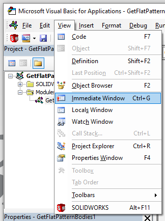
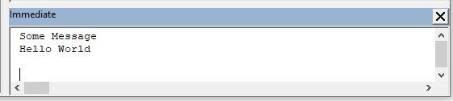

## 立即窗口

立即窗口是一个控制台，用于收集从代码中打印出的输出消息。

立即窗口通常用于调试和故障排除，作为输出日志或变量当前状态的简单方式。

要启用此窗口，请单击“查看->立即窗口”命令或使用快捷键“Ctrl+G”。

窗口可以停靠在 VBA 编辑器的任何面板上。

要将消息输出到此窗口，请使用“Debug.Print”命令

~~~ vb
Dim str As String
str = "Hello World"
Debug.Print "一些消息"
Debug.Print str
~~~

## 观察窗口